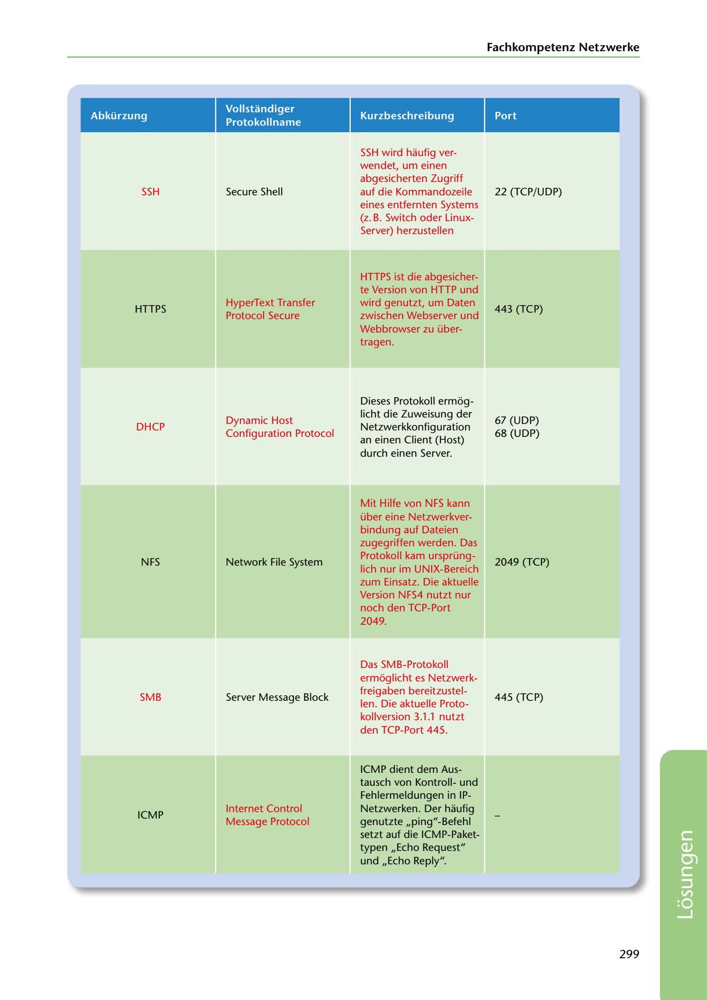

---
## Page 301
---

### Fachkompetenz Netzwerke

### Abkürzung

### Kurzbeschreibung

### Port

### Vollstandiger

### Protokol lname

SSH

Secure Shell

22 (TCP/UDP)

SSH wird haufig ver- wendet, um einen abgesicherten Zugriff auf die Kommandozeile eines entfernten Systems (z. B. Switch oder Linux- Server) herzustellen

HTTPS

443 (TCP)

HyperText Transfer Protocol Secure

HTTPS ist die abgesicher- te Version von HTTP und wird genutzt, um Daten zwischen Webserver und Webbrowser zu über- tragen.

DHCP

Dynamic Host Configuration Protocol

67 (UDP) 68 (UDP)

Dieses Protokoll ermog- licht die Zuweisung der Netzwerkkonfiguration an einen Client (Host) durch einen Server.

NFS

Network File System

2049 (TCP)

Mit Hilfe von NFS kann über eine Netzwerkver- bindung auf Dateien zugegriffen werden. Das Protokoll kam ursprüng- lich nur im UNIX-Bereich zum Einsatz. Die aktuelle Version NFS4 nutzt nur noch den TCP-Port 2049.

SMB

Server Message Block

445 (TCP)

Das SMB-Protokoll ermoglicht es Netzwerk- freigaben bereitzustel- len. Die aktuelle Proto- kollversion 3.1.1 nutzt den TCP-Port 445.

ICMP

Internet Control Message Protocol

ICMP dient dem Aus- tausch von Kontrollund Fehlermeldungen in IP- Netzwerken. Der haufig genutzte ,,ping"-Befehl setzt auf die ICMP-Paket- typen ,,Echo Request" und ,,Echo Reply".

299

<!-- IMAGE: page-301-img-1.jpeg - TODO: Add description -->
