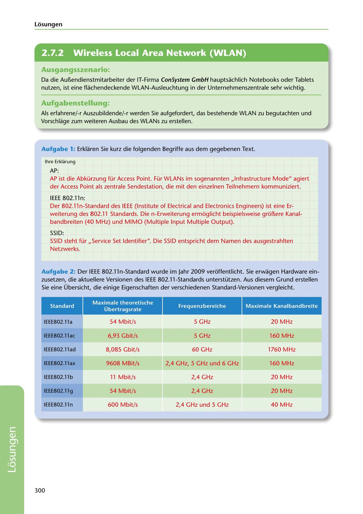

---
## Page 302
---

Losungen

<!-- IMAGE: page-302-img-1.jpeg - TODO: Add description -->

## Ausgangsszenario:

Da die Aul?.endienstmitarbeiter der IT-Firma ConSystem GmbH hauptsachlich Notebooks oder Tablets nutzen, ist eine flachendeckende WLAN-Ausleuchtung in der Unternehmenszentrale sehr wichtig.

## Aufgabenstellung.

Als erfahrene/-r Auszubildende/-r werden Sie aufgefordert, das bestehende WLAN zu begutachten und Vorschlage zum weiteren Ausbau des WLANs zu erstellen.

Aufgabe 1: Erklaren Sie kurz die folgenden Begriffe aus dem gegebenen Text.

lhre Erklarung

AP: AP ist die Abkürzung für Access Point. Für WLANs im sogenannten ,,lnfrastructure Mode" agiert der Access Point als zentrale Sendestation, die mit den einzelnen Teilnehmern kommuniziert.

IEEE 802.l ln: Der 802.11 n-Standard des IEEE (lnstitute of Electrical and Electronics Engineers) ist eine Er- weiterung des 802.11 Standards. Die n-Erweiterung ermóglicht beispielsweise gror..ere Kanal- bandbreiten (40 MHz) und MIMO (Multiple Input Multiple Output).

SSID: SSID steht für ,,Service Set ldentifier". Die SSID entspricht dem Namen des ausgestrahlten Netzwerks.

Aufgabe 2: Der IEEE 802.lln-Standard wurde im Jahr 2009 veróffentlicht. Sie erwagen Hardware ein- zusetzen, die aktuellere Versionen des IEEE 802.11-Standards unterstützen. Aus diesem Grund erstellen Sie eine Übersicht, die einige Eigenschaften der verschiedenen Standard-Versionen vergleicht.

### Standard

### Frequenzbereiche

### Maximale Kanalbandbreite

### Maximale theoretische

### Übertragsrate

### IEEE802.11a

54 Mbit/s

5 GHz 20 MHz

### IEEE802.11ac

5 GHz 160 MHz

6,93 Gbit/s

### IEEE802.11ad

8,085 Gbit/s

60 GHz 1760 MHz

### IEEE802.11ax

9608 MBit/s

2,4 GHz, 5 GHz und 6 GHz 160 MHz

### IEEE802.11 b

11 Mbit/s

2,4 GHz 20 MHz

### IEEE802.11g

54 Mbit/s

2,4 GHz 20 MHz

IEEE802.11 n

600 Mbit/s

2,4 GHz und 5 GHz 40 MHz

300

**[VISUAL: CONSYSTEM GMBH SOLUTION HEADER]**
Header image for the ConSystem GmbH WLAN standards and configuration solutions section.
