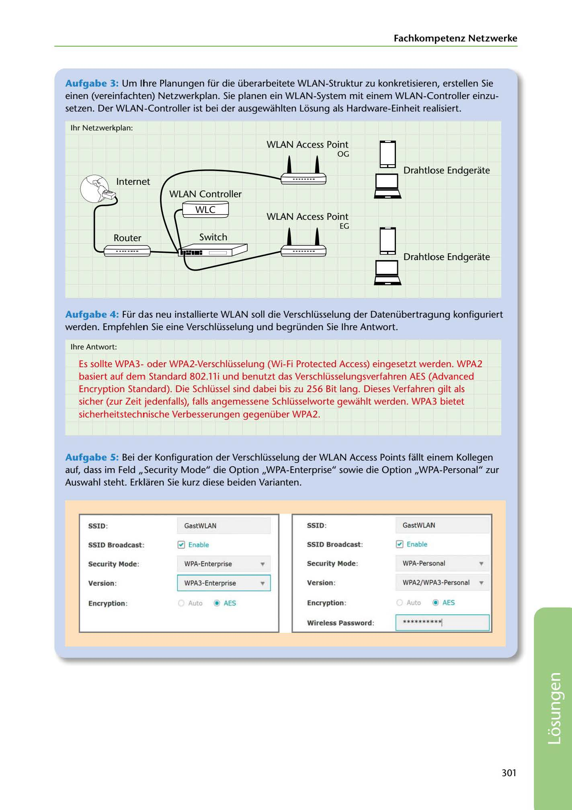

---
## Page 303
---

Fachkompetenz Netzwerke

Aufgabe 3: Um lhre Planungen für die überarbeitete WLAN-Struktur zu konkretisieren, erstellen Sie einen (vereinfachten) Netzwerkplan. Sie planen ein WLAN-System mit einem WLAN-Controller einzu- setzen. Der WLAN-Controller ist bei der ausgewahlten Losung als Hardware-Einheit realisiert.

1hr Netzwerkplan:

WLAN Access Point

<!-- IMAGE: page-303-img-1.jpeg - TODO: Add description -->

Internet

# OG 8

D,ahtlose Endge,ate

WLAN Controller

**[VISUAL: WLAN NETWORK ARCHITECTURE DIAGRAM WITH CONTROLLER - SOLUTION]**
A complete network diagram showing a two-floor WLAN deployment with centralized WLAN Controller (WLC). Shows: Internet connection → Router → WLAN Controller → Access Points on each floor (OG and EG) → Wireless end devices. Also includes WPA security configuration screenshots showing WPA-Enterprise vs WPA-Personal settings with encryption options (AES, WPA2/WPA3).

WLC

Router

**[VISUAL: WLAN NETWORK ARCHITECTURE DIAGRAM WITH CONTROLLER - SOLUTION]**
A complete network diagram showing a two-floor WLAN deployment with centralized WLAN Controller (WLC). Shows: Internet connection → Router → WLAN Controller → Access Points on each floor (OG and EG) → Wireless end devices. Also includes WPA security configuration screenshots showing WPA-Enterprise vs WPA-Personal settings with encryption options (AES, WPA2/WPA3).

**[VISUAL: WLAN NETWORK ARCHITECTURE DIAGRAM WITH CONTROLLER - SOLUTION]**
A complete network diagram showing a two-floor WLAN deployment with centralized WLAN Controller (WLC). Shows: Internet connection → Router → WLAN Controller → Access Points on each floor (OG and EG) → Wireless end devices. Also includes WPA security configuration screenshots showing WPA-Enterprise vs WPA-Personal settings with encryption options (AES, WPA2/WPA3).

# EG 8

WLAN Access Point D,ahtlose Endge,ate

Aufgabe 4: Für das neu installierte WLAN soll die Verschlüsselung der Datenübertragung konfiguriert werden. Empfehlen Sie eine Verschlüsselung und begründen Sie lhre Antwort.

lhre Antwort:

Es sollte WPA3oder WPA2-Verschlüsselung (Wi-Fi Protected Access) eingesetzt werden. WPA2 basiert auf dem Standard 802.11 i und benutzt das Verschlüsselungsverfahren AES (Advanced Encryption Standard). Die Schlüssel sind dabei bis zu 256 Bit lang. Dieses Verfahren gilt als sicher (zur Zeit jedenfalls), falls angemessene Schlüsselworte gewahlt werden. WPA3 bietet sicherheitstechnische Verbesserungen gegenüber WPA2.

Aufgabe 5: Bei der Konfiguration der Verschlüsselung der WLAN Access Points fallt einem Kollegen auf, dass im Feld ,,Security Mode" die Option ,,WPA-Enterprise" sowie die Option ,,WPA-Personal" zur Auswahl steht. Erklaren Sie kurz diese beiden Varianten.

### SSID:

### GastWLAN

### SSID:

### GastWLAN

### SSID Broadcast:

### SSID Broadcast:

0 Enable 0 Enable

### Security Mode:

# •

### Security Mode:

## ..

WPA-Enterprise WPA-Personal

### Version:

### Version:

# WPA2/ WPA3-Personal ..

WPA3Enterprise • 1

### Encryption:

## Auto • AES

### Encryption:

Auto • AES

### Wlreless Password:

*********~

301

**[VISUAL: WLAN NETWORK ARCHITECTURE DIAGRAM WITH CONTROLLER - SOLUTION]**
A complete network diagram showing a two-floor WLAN deployment with centralized WLAN Controller (WLC). Shows: Internet connection → Router → WLAN Controller → Access Points on each floor (OG and EG) → Wireless end devices. Also includes WPA security configuration screenshots showing WPA-Enterprise vs WPA-Personal settings with encryption options (AES, WPA2/WPA3).
