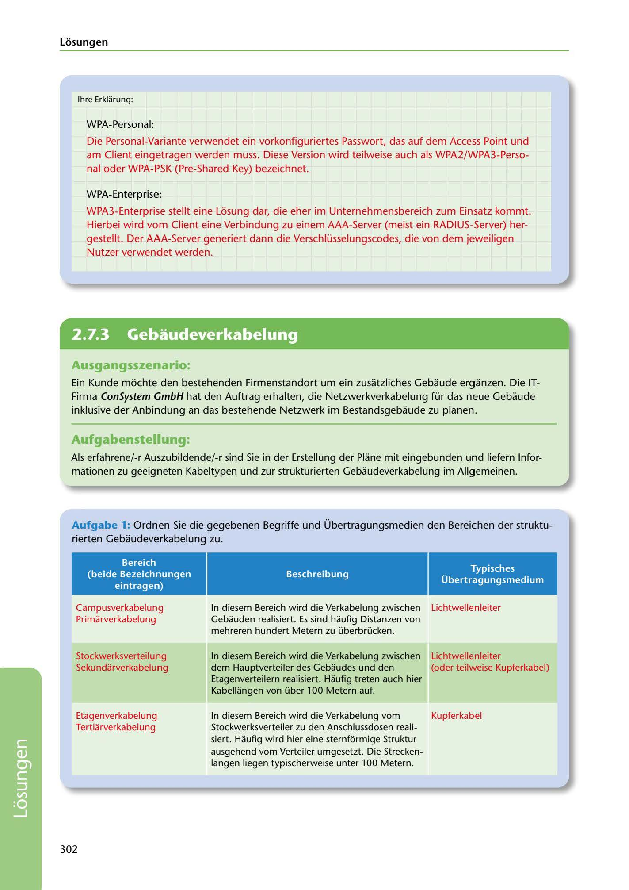

---
## Page 304
---

Losungen

lhre Erklarung:

WPA-Personal:

Die Personal-Variante verwendet ein vorkonfiguriertes Passwort, das auf dem Access Point und am Client eingetragen werden muss. Diese Version wird teilweise auch als WPA2/WPA3-Perso- nal oder WPA-PSK (Pre-Shared Key) bezeichnet.

WPA-Enterprise:

WPA3-Enterprise stellt eine Lé:isung dar, die eher im Unternehmensbereich zum Einsatz kommt. Hierbei wird vom Client eine Verbindung zu einem AAA-Server (meist ein RADIUS-Server) her- gestellt. Der AAA-Server generiert dann die Verschlüsselungscodes, die von dem jeweiligen Nutzer verwendet werden.

<!-- IMAGE: page-304-img-1.jpeg - TODO: Add description -->

**[VISUAL: CONSYSTEM GMBH SOLUTION HEADER]**
Header image for the ConSystem GmbH structured cabling solutions section.

## Ausgangsszenario:

Ein Kunde mé:ichte den bestehenden Firmenstandort um ein zusatzliches Gebaude erganzen. Die IT- Firma ConSystem GmbH hat den Auftrag erhalten, die Netzwerkverkabelung für das neue Gebaude inklusive der Anbindung andas bestehende Netzwerk im Bestandsgebaude zu planen.

## Aufgabenstellung:

Als erfahrene/-r Auszubildende/-r sind Sie in der Erstellung der Plane mit eingebunden und liefern lnfor- mationen zu geeigneten Kabeltypen und zur strukturierten Gebaudeverkabelung im Allgemeinen.

Aufgabe 1: Ordnen Sie die gegebenen Begriffe und Übertragungsmedien den Bereichen der struktu- rierten Gebaudeverkabelung zu.

### Beschreibung

### Typisches

### Übertragungsmedium

### Bereich

### (beide Bezeichnungen

### eintragen)

Lichtwellenleiter

Campusverkabelung Primarverkabelung

In diesem Bereich wird die Verkabelung zwischen Gebauden realisiert. Es sind haufig Distanzen von mehreren hundert Metern zu überbrücken.

Stockwerksverteilung Sekundarverkabelung

Lichtwellenleiter (oder teilweise Kupferkabel)

In diesem Bereich wird die Verkabelung zwischen dem Hauptverteiler des Gebaudes und den Etagenverteilern realisiert. Haufig treten auch hier Kabellangen von über 100 Metern auf.

Kupferkabel

Etagenverkabelung Tertiarverkabelung

In diesem Bereich wird die Verkabelung vom Stockwerksverteiler zu den Anschlussdosen reali- siert. Haufig wird hier eine sternfürmige Struktur ausgehend vom Verteiler umgesetzt. Die Strecken- langen liegen typischerweise unter 100 Metern.

302

**[VISUAL: CONSYSTEM GMBH SOLUTION HEADER]**
Header image for the ConSystem GmbH structured cabling solutions section.
