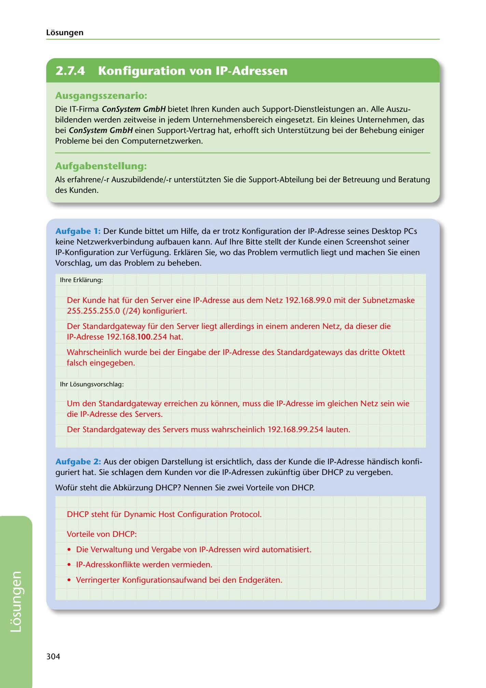

---
## Page 306
---

### Losungen

<!-- IMAGE: page-306-img-1.jpeg - TODO: Add description -->

**[VISUAL: CONSYSTEM GMBH SOLUTION HEADER]**
Header image for the ConSystem GmbH network troubleshooting and IP configuration solutions section.

## Ausgangsszenario:

Die IT-Firma ConSystem GmbH bietet lhren Kunden auch Support-Dienstleistungen an. Alle Auszu- bildenden werden zeitweise in jedem Unternehmensbereich eingesetzt. Ein kleines Unternehmen, das bei ConSystem GmbH einen Support-Vertrag hat, erhofft sich Unterstützung bei der Behebung einiger Probleme bei den Computernetzwerken.

## Aufgabenstellung:

Als erfahrene/-r Auszubildende/-r unterstützten Sie die Support-Abteilung bei der Betreuung und Beratung des Kunden.

Aufgabe 1: Der Kunde bittet um Hilfe, da er trotz Konfiguration der IP-Adresse seines Desktop PCs keine Netzwerkverbindung aufbauen kann. Auf lhre Bitte stellt der Kunde einen Screenshot seiner IP-Konfiguration zur Verfügung. Erklaren Sie, wo das Problem vermutlich liegt und machen Sie einen Vorschlag, um das Problem zu beheben.

lhre Erklarung:

Der Kunde hat für den Server eine IP-Adresse aus dem Netz 192.168.99.0 mit der Subnetzmaske 255.255.255.0 (/24) konfiguriert.

Der Standardgateway für den Server liegt allerdings in einem anderen Netz, da dieser die IP-Adresse 192.168.100.254 hat.

Wahrscheinlich wurde bei der Eingabe der IP-Adresse des Standardgateways das dritte Oktett falsch eingegeben.

1hr Losungsvorschlag:

Um den Standardgateway erreichen zu konnen, muss die IP-Adresse im gleichen Netz sein wie die IP-Adresse des Servers.

Der Standardgateway des Servers muss wahrscheinlich 192.168.99.254 lauten.

Aufgabe 2: Aus der obigen Darstellung ist ersichtlich, dass der Kunde die IP-Adresse handisch konfi- guriert hat. Sie schlagen dem Kunden vor die IP-Adressen zukünftig über DHCP zu vergeben.

Wofür steht die Abkürzung DHCP? Nen nen Sie zwei Vorteile von DHCP.

DHCP steht für Dynamic Host Configuration Protocol.

Vorteile von DHCP:

• Die Verwaltung und Vergabe von IP-Adressen wird automatisiert.

• IP-Adresskonflikte werden vermieden.

• Verringerter Konfigurationsaufwand bei den Endgeraten.

304

**[VISUAL: CONSYSTEM GMBH SOLUTION HEADER]**
Header image for the ConSystem GmbH network troubleshooting and IP configuration solutions section.
