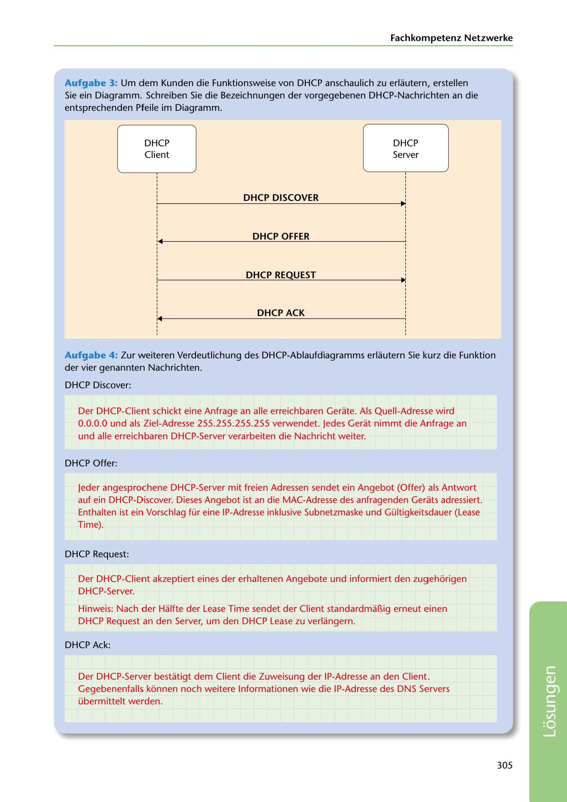

---
## Page 307
---

Fachkompetenz Netzwerke

Aufgabe 3: Um dem Kunden die Funktionsweise van DHCP anschaulich zu erlautern, erstellen Sie ein Diagramm. Schreiben Sie die Bezeichnungen der vorgegebenen DHCP-Nachrichten an die entsprechenden Pfeile im Diagramm.

DHCP Client

DHCP Server

### DHCP DISCOVER

DHCP OFFER

DHCP REQUEST

DHCP ACK

Aufgabe 4 : Zur weiteren Verdeutlichung des DHCP-Ablaufdiagramms erlautern Sie kurz die Funktion der vier genannten Nachrichten.

DHCP Discover:

Der DHCP-Client schickt eine Anfrage an alle erreichbaren Gerate. Als Quell-Adresse wird O.O.O.O und als Ziel-Adresse 255.255.255.255 verwendet. Jedes Gerat nimmt die Anfrage an und alle erreichbaren DHCP-Server verarbeiten die Nachricht weiter.

DHCP Offer:

Jeder angesprochene DHCP-Server mit freien Adressen sendet ein Angebot (Offer) als Antwort auf ein DHCP-Discover. Dieses Angebot ist an die MAC-Adresse des anfragenden Gerats adressiert. Enthalten ist ein Vorschlag für eine IP-Adresse inklusive Subnetzmaske und Gültigkeitsdauer (Lease Time).

DHCP Request:

Der DHCP-Client akzeptiert eines der erhaltenen Angebote und informiert den zugehé:irigen DHCP-Server.

Hinweis: Nach der Halfte der Lease Time sendet der Client standardmaf1ig erneut einen DHCP Request an den Server, um den DHCP Lease zu verlangern.

DHCP Ack:

Der DHCP-Server bestatigt dem Client die Zuweisung der IP-Adresse an den Client. Gegebenenfalls konnen noch weitere lnformationen wie die IP-Adresse des DNS Servers übermittelt werden.

305

<!-- IMAGE: page-307-img-1.jpeg - TODO: Add description -->
