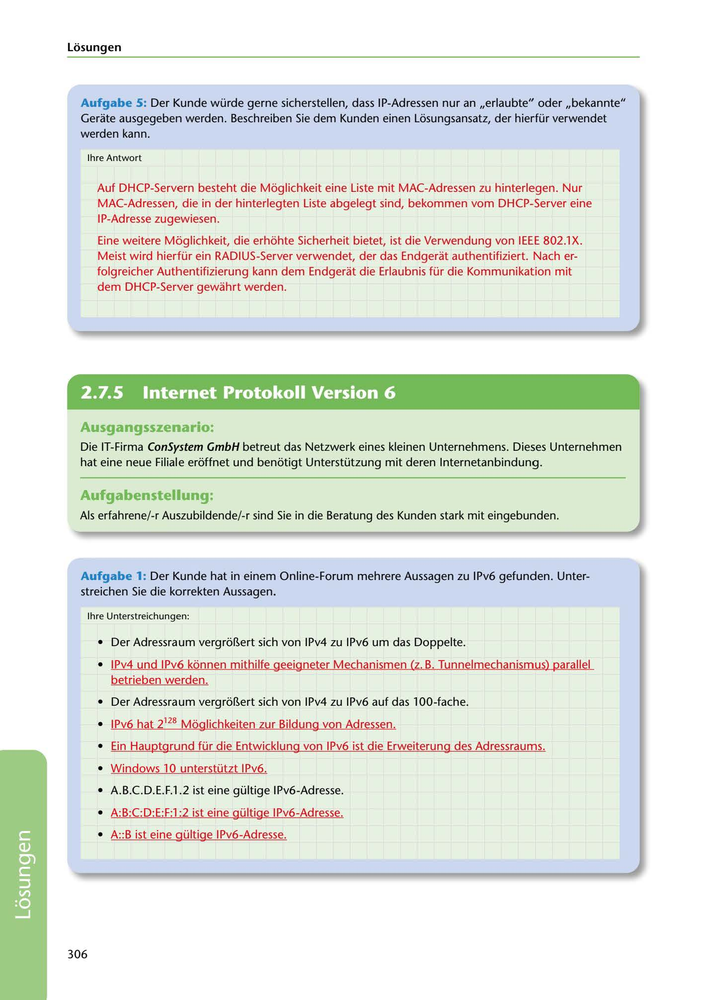

---
## Page 308
---

Losungen

Aufgabe 5: Der Kunde würde gerne sicherstellen, dass IP-Adressen nur an ,,erlaubte" oder ,,bekannte" Gerate ausgegeben werden. Beschreiben Sie dem Kunden einen Losungsansatz, der hierfür verwendet werden kann.

lhre Antwort

Auf DHCP-Servern besteht die Moglichkeit eine Liste mit MAC-Adressen zu hinterlegen. Nur MAC-Adressen, die in der hinterlegten Liste abgelegt sind, bekommen vom DHCP-Server eine 1 P-Adresse zugewiesen.

Eine weitere Moglichkeit, die erhohte Sicherheit bietet, ist die Verwendung von IEEE 802.lX. Meist wird hierfür ein RADIUS-Server verwendet, der das Endgerat authentifiziert. Nach er- folgreicher Authentifizierung kann dem Endgerat die Erlaubnis für die Kommunikation mit dem DHCP-Server gewahrt werden.

<!-- IMAGE: page-308-img-1.jpeg - TODO: Add description -->

**[VISUAL: CONSYSTEM GMBH SOLUTION HEADER]**
Header image for the ConSystem GmbH IPv6 and DHCP security solutions section.

## Ausgangsszenario:

Die IT-Firma ConSystem GmbH betreut das Netzwerk eines kleinen Unternehmens. Dieses Unternehmen hat eine neue Filiale eroffnet und benotigt Unterstützung mit deren lnternetanbindung.

## Aufgabenstellung:

Als erfahrene/-r Auszubildende/-r sind Sie in die Beratung des Kunden stark mit eingebunden.

Aufgabe 1: Der Kunde hat in einem Online-Forum mehrere Aussagen zu IPv6 gefunden. Unter- streichen Sie die korrekten Aussagen.

lhre Unterstreichungen:

• Der Adressraum vergr6'1ert sich von IPv4 zu IPv6 um das Doppelte.

• IPv4 und IPv6 konnen mithilfe geeigneter Mechanismen (z. B. Tunnelmechanismus) parallel

betrieben werden.

• Der Adressraum vergr611ert sich von IPv4 zu IPv6 auf das 100-fache.

• IPv6 hat 2128 Moglichkeiten zur Bildung von Adressen.

• Ein Hauptgrund für die Entwicklung von IPv6 ist die Erweiterung des Adressraums.

• Windows 10 unterstützt IPv6.

• A.B.C.D.E.F.1.2 ist eine gültige IPv6-Adresse.

• A:B:C:D:E:F:1 :2 ist eine gültige IPv6-Adresse.

• A::B ist eine gültige IPv6-Adresse.

306

**[VISUAL: CONSYSTEM GMBH SOLUTION HEADER]**
Header image for the ConSystem GmbH IPv6 and DHCP security solutions section.
