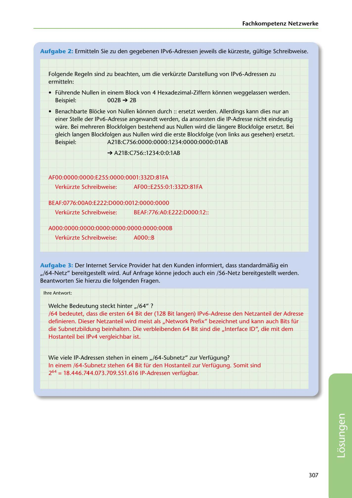

---
## Page 309
---

Fachkompetenz Netzwerke

Aufgabe 2: Ermitteln Sie zu den gegebenen IPv6-Adressen jeweils die kürzeste, gültige Schreibweise.

Folgende Regeln sind zu beachten, um die verkürzte Darstellung van IPv6-Adressen zu ermitteln:

• Führende Nullen in einem Block van 4 Hexadezimal-Ziffern kbnnen weggelassen werden.

Beispiel: 002B ➔ 2B

• Benachbarte Blbcke van Nullen kbnnen durch :: ersetzt werden. Allerdings kann dies nur an

einer Stelle der IPv6-Adresse angewandt werden, da ansonsten die IP-Adresse nicht eindeutig ware. Bei mehreren Blockfolgen bestehend aus Nullen wird die langere Blockfolge ersetzt. Bei gleich langen Blockfolgen aus Nullen wird die erste Blockfolge (van links aus gesehen) ersetzt. Beispiel: A21 B:C756:0000:0000:1234:0000:0000:01AB

➔ A21B:C756::1234:0:0:1AB

AFOO:OOOO:OOOO:E255:0000:0001 :332D:81 FA

Verkürzte Sclhreibweise: AFOO::E255:0:l :332D:81 FA

BEAF:0776:00AO: E222: D000:0012:0000:0000

Verkürzte Scllreibweise: BEAF:776:AO:E222:DOOO:l 2::

A000:0000:0000:0000:0000:0000:0000:000B

Verkürzte Scllreibweise: AOOO::B

Aufgabe 3: Der Internet Service Provider hat den Kunden informiert, dass standardma~ig ein ,,/64-Netz" bereitgestellt wird. Auf Anfrage kbnne jedoch auch ein /56-Netz bereitgestellt werden. Beantworten Sie hierzu die folgenden Fragen.

lhre Antwort:

Welche Bedeutung steckt hinter ,,/64" ? /64 bedeutet, dass die ersten 64 Bit der (128 Bit langen) IPv6-Adresse den Netzanteil der Adresse definieren. Dieser Netzanteil wird meist als ,,Network Prefix" bezeichnet und kann auch Bits für die Subnetzbildung beinhalten. Die verbleibenden 64 Bit sind die ,,Interface ID", die mit dem Hostanteil bei IPv4 vergleichbar ist.

Wie viele IP-Adressen stehen in einem ,,/64-Subnetz" zur Verfügung?

In einem /64-Subnetz stehen 64 Bit für den Hostanteil zur Verfügung. Somit sind 264 = 18.446.744.073.709.551.616 IP-Adressen verfügbar.

307

<!-- IMAGE: page-309-img-1.jpeg - TODO: Add description -->
