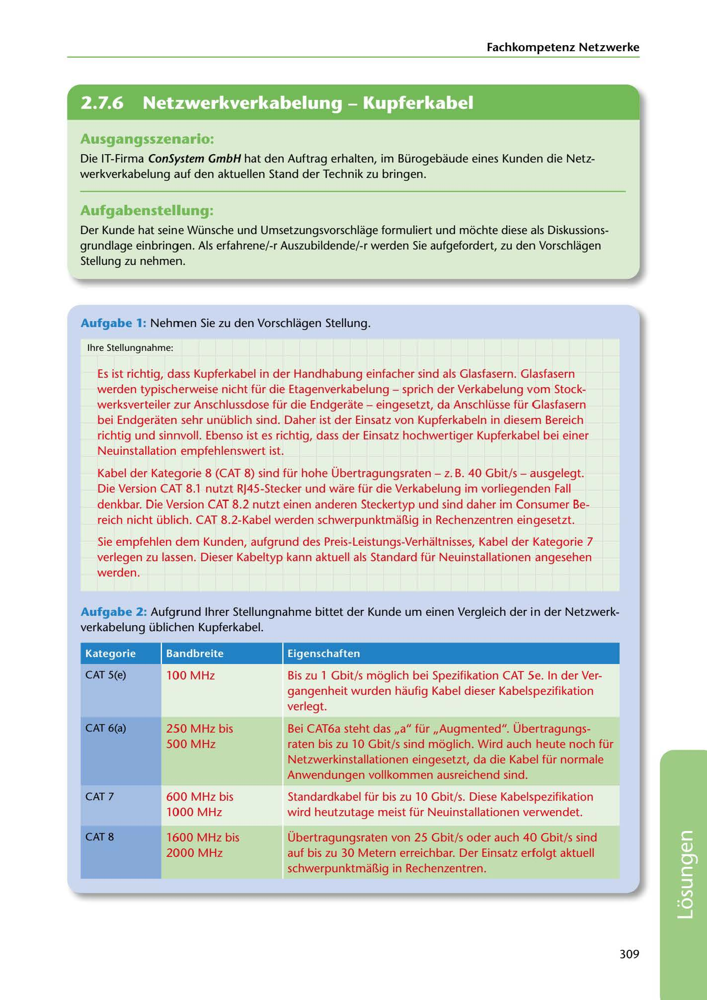

---
## Page 311
---

Fachkompetenz Netzwerke

<!-- IMAGE: page-311-img-1.jpeg - TODO: Add description -->

## Ausgangsszenario:

Die IT-Firma ConSystem GmbH hat den Auftrag erhalten, im Bürogebaude eines Kunden die Netz- werkverkabelung auf den aktuellen Stand der Technik zu bringen.

## Aufgabenstellung:

Der Kunde hat seine Wünsche und Umsetzungsvorschlage formuliert und móchte diese als Diskussions- grundlage einbringen. Als erfahrene/-r Auszubildende/-r werden Sie aufgefordert, zu den Vorschlagen Stellung zu nehmen.

### Aufgabe 1: Nehmen Sie zu den Vorschlagen Stellung.

lhre Stellungnahme:

Es ist richtig, dass Kupferkabel in der Handhabung einfacher sind als Glasfasern. Glasfasern werden typischerweise nicht für die Etagenverkabelung - sprich der Verkabelung vom Stock- werksverteiler zur Anschlussdose für die Endgerate - eingesetzt, da Anschlüsse für Glasfasern bei Endgeraten sehr unüblich sind. Daher ist der Einsatz von Kupferkabeln in diesem Bereich richtig und sinnvoll. Ebenso ist es richtig, dass der Einsatz hochwertiger Kupferkabel bei einer Neuinstallation empfehlenswert ist.

Kabel der Kategorie 8 (CAT 8) sind für hohe Übertragungsraten - z. B. 40 Gbit/s - ausgelegt. Die Version CAT 8.1 nutzt RJ45-Stecker und ware für die Verkabelung im vorliegenden Fall denkbar. Die Version CAT 8.2 nutzt einen anderen Steckertyp und sind daher im Consumer Be- reich nicht üblich. CAT 8.2-Kabel werden schwerpunktmal1ig in Rechenzentren eingesetzt.

Sie empfehlen dem Kunden, aufgrund des Preis-Leistungs-Verhaltnisses, Kabel der Kategorie 7 verlegen zu lassen. Dieser Kabeltyp kann aktuell als Standard für Neuinstallationen angesehen werden.

Aufgabe 2: Aufgrund lhrer Stellungnahme bittet der Kunde um einen Vergleich der in der Netzwerk- verkabelung üblichen Kupferkabel.

Kategorie

Bandbreite

Eigenschaften

CAT 5(e)

100 MHz

Bis zu 1 Gbit/s móglich bei Spezifikation CAT Se. In der Ver- gangenheit wurden haufig Kabel dieser Kabelspezifikation verlegt.

CAT 6(a)

250 MHz bis 500 MHz

Bei CAT6a steht das ,,a" für ,,Augmented". Übertragungs- raten bis zu 10 Gbit/s sind móglich. Wird auch heute noch für Netzwerkinstallationen eingesetzt, da die Kabel für normale Anwendungen vollkommen ausreichend sind.

CAT 7

600 MHz bis 1000 MHz

Standardkabel für bis zu 10 Gbit/s. Diese Kabelspezifikation wird heutzutage meist für Neuinstallationen verwendet.

### CAT 8

1600 MHz bis 2000 MHz

Übertragungsraten von 25 Gbit/s oder auch 40 Gbit/s sind auf bis zu 30 Metern erreichbar. Der Einsatz erfolgt aktuell schwerpunktmal1ig in Rechenzentren.

309

**[VISUAL: CONSYSTEM GMBH SOLUTION HEADER]**
Header image for the ConSystem GmbH network cabling modernization solutions section.
