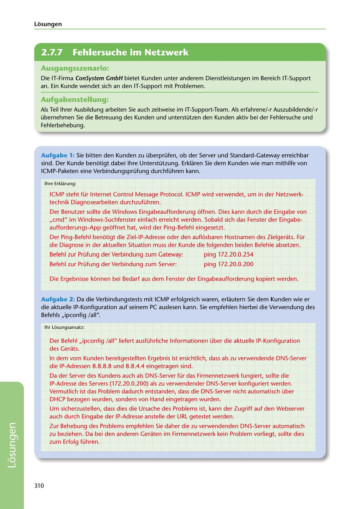

---
## Page 312
---

### Losungen

<!-- IMAGE: page-312-img-1.jpeg - TODO: Add description -->

## Ausgangsszenario:

Die IT-Firma ConSystem GmbH bietet Kunden unter anderem Dienstleistungen im Bereich IT-Support an. Ein Kunde wendet sich an den IT-Support mit Problemen.

## Aufgabenstellung:

Als Teil lhrer Ausbildung arbeiten Sie auch zeitweise im IT-Support-Team. Als erfahrene/-r Auszubildende/-r übernehmen Sie die Betreuung des Kunden und unterstützen den Kunden aktiv bei der Fehlersuche und Fehlerbehebung.

**[VISUAL: CONSYSTEM GMBH SOLUTION HEADER]**
Header image for the ConSystem GmbH network troubleshooting with ICMP and DNS solutions section.

Aufgabe 1: Sie bitten den Kunden zu überprüfen, ob der Server und Standard-Gateway erreichbar sind. Der Kunde benotigt dabei lhre Unterstützung. Erklaren Sie dem Kunden wie man mithilfe von ICMP-Paketen eine Verbindungsprüfung durchführen kann.

lhre Erklarung:

ICMP steht für Internet Control Message Protocol. ICMP wird verwendet, um in der Netzwerk- technik Diagnosearbeiten durchzuführen.

Der Benutzer sollte die Windows Eingabeaufforderung offnen. Dies kann durch die Eingabe von ,,cmd" im Windows-Suchfenster einfach erreicht werden. Sobald sich das Fenster der Eingabe- aufforderungs-App geoffnet hat, wird der Ping-Befehl eingesetzt.

Der Ping-Befehll benotigt die Ziel-lP-Adresse oder den auflosbaren Hostnamen des Zielgerats. Für die Diagnose in der aktuellen Situation muss der Kunde die folgenden beiden Befehle absetzen.

Befehl zur Prüfung der Verbindung zum Gateway: ping 172.20.0.254

Befehl zur Prüfung der Verbindung zum Server: ping 172.20.0.200

Die Ergebnisse konnen bei Bedarf aus dem Fenster der Eingabeaufforderung kopiert werden.

Aufgabe 2: Da die Verbindungstests mit ICMP erfolgreich waren, erlautern Sie dem Kunden wie er die aktuelle IP-Konfiguration auf seinem PC auslesen kann. Sie empfehlen hierbei die Verwendung des Befehls ,,ipconfig /all".

1hr Losungsansatz:

Der Befehl ,,ipconfig /all" liefert ausführliche lnformationen über die aktuelle IP-Konfiguration des Gerats.

In dem vom Kunden bereitgestellten Ergebnis ist ersichtlich, dass als zu verwendende DNS-Server die IP-Adressen 8.8.8.8 und 8.8.4.4 eingetragen sind.

Da der Server des Kundens auch als DNS-Server für das Firmennetzwerk fungiert, sollte die IP-Adresse des Servers (172.20.0.200) als zu verwendender DNS-Server konfiguriert werden. Vermutlich ist das Problem dadurch entstanden, dass die DNS-Server nicht automatisch über DHCP bezogen wurden, sondern von Hand eingetragen wurden.

Um sicherzustellen, dass dies die Ursache des Problems ist, kann der Zugriff auf den Webserver auch durch Eingabe der IP-Adresse anstelle der URL getestet werden.

Zur Behebung des Problems empfehlen Sie daher die zu verwendenden DNS-Server automatisch zu beziehen. Da bei den anderen Geraten im Firmennetzwerk kein Problem vorliegt, sollte dies zum Erfolg führen.

310

**[VISUAL: CONSYSTEM GMBH SOLUTION HEADER]**
Header image for the ConSystem GmbH network troubleshooting with ICMP and DNS solutions section.
