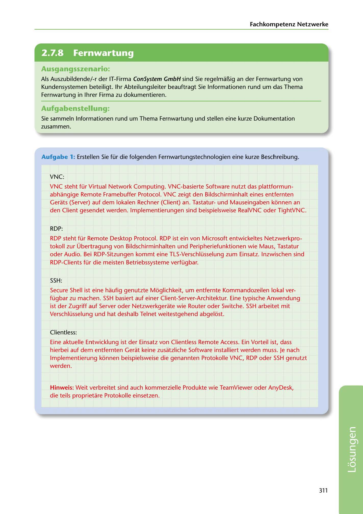

---
## Page 313
---

Fachkompetenz Netzwerke

<!-- IMAGE: page-313-img-1.jpeg - TODO: Add description -->

## Ausgangsszenario:

Als Auszubildende/-r der IT-Firma ConSystem GmbH sind Sie regelmaBig an der Fernwartung von Kundensystemen beteiligt. 1hr Abteilungsleiter beauftragt Sie lnformationen rund um das Thema Fernwartung in lhrer Firma zu dokumentieren.

## Aufgabenstellung.

Sie sammeln lnformationen rund um Thema Fernwartung und stellen eine kurze Dokumentation zusammen.

Aufgabe 1: Erstellen Sie für die folgenden Fernwartungstechnologien eine kurze Beschreibung.

VNC:

VNC steht für Virtual Network Computing. VNC-basierte Software nutzt das plattformun- abhangige Remote Framebuffer Protocol. VNC zeigt den Bildschirminhalt eines entfernten Gerats (Server) auf dem lokalen Rechner (Client) an. Tastaturund Mauseingaben kéinnen an den Client gesendet werden. lmplementierungen sind beispielsweise RealVNC oder TightVNC.

RDP:

RDP steht für Remote Desktop Protocol. RDP ist ein von Microsoft entwickeltes Netzwerkpro- tokoll zur Übertragung von Bildschirminhalten und Peripheriefunktionen wie Maus, Tastatur oder Audio. Bei RDP-Sitzungen kommt eine TLS-Verschlüsselung zum Einsatz. lnzwischen sind RDP-Clients für die meisten Betriebssysteme verfügbar.

SSH:

Secure Shell ist eine haufig genutzte Méiglichkeit, um entfernte Kommandozeilen lokal ver- fügbar zu machen. SSH basiert auf einer Client-Server-Architektur. Eine typische Anwendung

ist der Zugriff auf Server oder Netzwerkgerate wie Router oder Switche. SSH arbeitet mit Verschlüsselung und hat deshalb Telnet weitestgehend abgeléist.

Clientless:

Eine aktuelle Entwicklung ist der Einsatz von Clientless Remote Access. Ein Vorteil ist, dass hierbei auf dem entfernten Gerat keine zusatzliche Software installiert werden muss. Je nach lmplementierung kéinnen beispielsweise die genannten Protokolle VNC, RDP oder SSH genutzt werden.

Hinweis: Weit verbreitet sind auch kommerzielle Produkte wie TeamViewer oder AnyDesk, die teils proprietare Protokolle einsetzen.

### 311

**[VISUAL: CONSYSTEM GMBH SOLUTION HEADER]**
Header image for the ConSystem GmbH remote maintenance technologies (VNC, RDP, SSH) solutions section.
