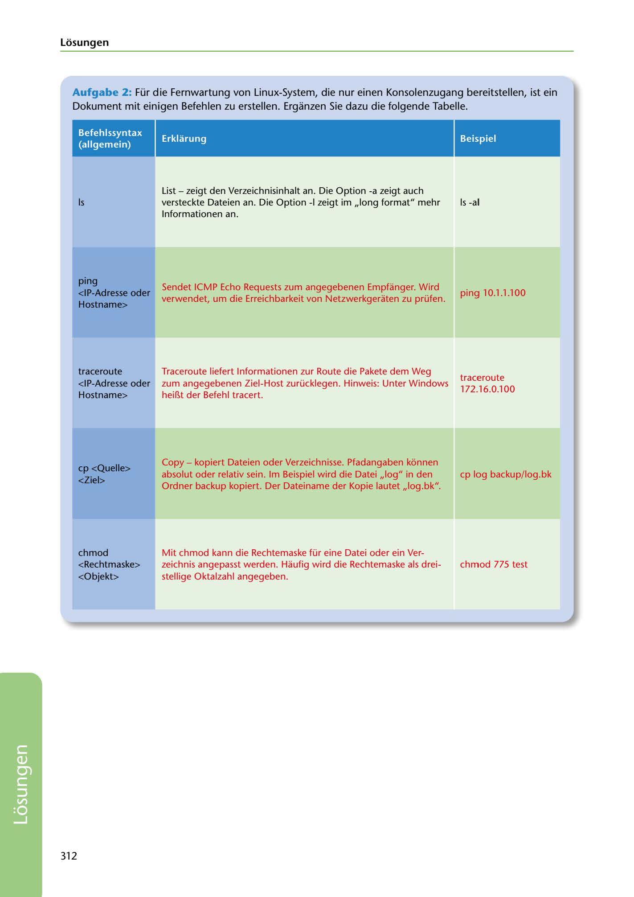

---
## Page 314
---

Losungen

Aufgabe 2: Für die Fernwartung von Linux-System, die nur einen Konsolenzugang bereitstellen, ist ein Dokument mit einigen Befehlen zu erstellen. Erganzen Sie dazu die folgende Tabelle.

### Erklarung

### Beispiel

### Befehlssyntax

### (allgemein)

### Is

Is -al

List - zeigt den Verzeichnisinhalt an. Die Option -a zeigt auch versteckte Dateien an. Die Option -1 zeigt im ,,long format" mehr lnformationen an.

ping 10.1.1.100

Sendet ICMP Echo Requests zum angegebenen Empfanger. Wird verwendet, um die Erreichbarkeit von Netzwerkgeraten zu prüfen.

### ping

### <IP-Adresse oder

### Hostname>

traceroute

Traceroute liefert lnformationen zur Route die Pakete dem Weg zum angegebenen Ziel-Host zurücklegen. Hinweis: Unter Windows

172.16.0.100

traceroute <IP-Adresse oder Hostname>

heiBt der Befehl tracert.

cp log backup/log.bk

### cp <Quelle>

### <Ziel>

Copy - kopiert Dateien oder Verzeichnisse. Pfadangaben konnen absolut oder relativ sein. lm Beispiel wird die Datei ,,log" in den Ordner backup kopiert. Der Dateiname der Kopie lautet ,,log.bk".

chmod 775 test

Mit chmod kann die Rechtemaske für eine Datei oder ein Ver- zeichnis angepasst werden. Haufig wird die Rechtemaske als drei- stellige Oktalzahl angegeben.

### <Rechtmaske>

### <Objekt>

chmod

312

<!-- IMAGE: page-314-img-1.jpeg - TODO: Add description -->
