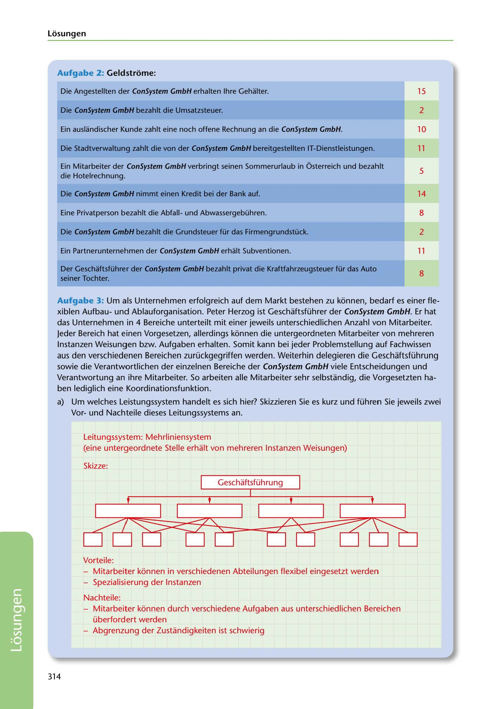

---
## Page 316
---

Losungen

### Aufgabe 2: Geldstrome:

Die Angestellten der ConSystem GmbH erhalten lhre Gehalter.

15

Die ConSystem GmbH bezahlt die Umsatzsteuer.

2

Ein auslandischer Kunde zahlt eine noch offene Rechnung an die ConSystem GmbH.

10

Die Stadtverwaltung zahlt die von der ConSystem GmbH bereitgestellten IT-Dienstleistungen.

11

5

Ein Mitarbeiter der ConSystem GmbH verbringt seinen Sommerurlaub in Ósterreich und bezahlt die Hotelrechnung.

### Die ConSystem GmbH nimmt einen Kredit bei der Bank auf.

14

Eine Privatperson bezahlt die Abfallund Abwassergebühren.

8

Die ConSystem GmbH bezahlt die Grundsteuer für das Firmengrundstück.

2

Ein Partnerunternehmen der ConSystem GmbH erhalt Subventionen.

11

8

Der Geschaftsführer der ConSystem GmbH bezahlt privat die Kraftfahrzeugsteuer für das Auto seiner Tochter.

Aufgabe 3: Um als Unternehmen erfolgreich auf dem Markt bestehen zu konnen, bedarf es einer fle- xiblen Aufbauund Ablauforganisation. Peter Herzog ist Geschaftsführer der ConSystem GmbH. Er hat das Unternehmen in 4 Bereiche unterteilt mit einer jeweils unterschiedlichen Anzahl von Mitarbeiter. Jeder Bereich hat einen Vorgesetzen, allerdings konnen die untergeordneten Mitarbeite1r von mehreren lnstanzen Weisungen bzw. Aufgaben erhalten. Somit kann bei jeder Problemstellung auf Fachwissen aus den verschiedenen Bereichen zurückgegriffen werden. Weiterhin delegieren die Geschaftsführung sowie die Verantwortlichen der einzelnen Bereiche der ConSystem GmbH viele Entscheidungen und Verantwortung an ihre Mitarbeiter. So arbeiten alle Mitarbeiter sehr selbstandig, die Vorgesetzten ha-

ben lediglich eine Koordinationsfunktion.

a) Um welches Leistungssystem handelt es sich hier? Skizzieren Sie es kurz und führen Sie jeweils zwei Vorund Nachteile dieses Leitungssystems an.

Leitungssystem: Mehrliniensystem (eine untergeordnete Stelle erhalt von mehreren lnstanzen Weisungen)

Skizze:

Geschaftsführung

<!-- IMAGE: page-316-img-1.jpeg - TODO: Add description -->

Vorteile: - Mitarbeiter konnen in verschiedenen Abteilungen flexibel eingesetzt werden - Spezialisierung der lnstanzen

Nachteile: - Mitarbeiter konnen durch verschiedene Aufgaben aus unterschiedlichen Bereichen überfordert werden - Abgrenzung der Zustandigkeiten ist schwierig

314

**[VISUAL: MULTI-LINE ORGANIZATIONAL CHART (MEHRLINIENSYSTEM) - SOLUTION]**
An organizational chart illustrating the multi-line management system (Mehrliniensystem) for ConSystem GmbH. Shows Geschäftsführung (management) at top with subordinate departments, where employees can receive instructions from multiple supervisors. Demonstrates the coordination function and flexible resource allocation across departments.
