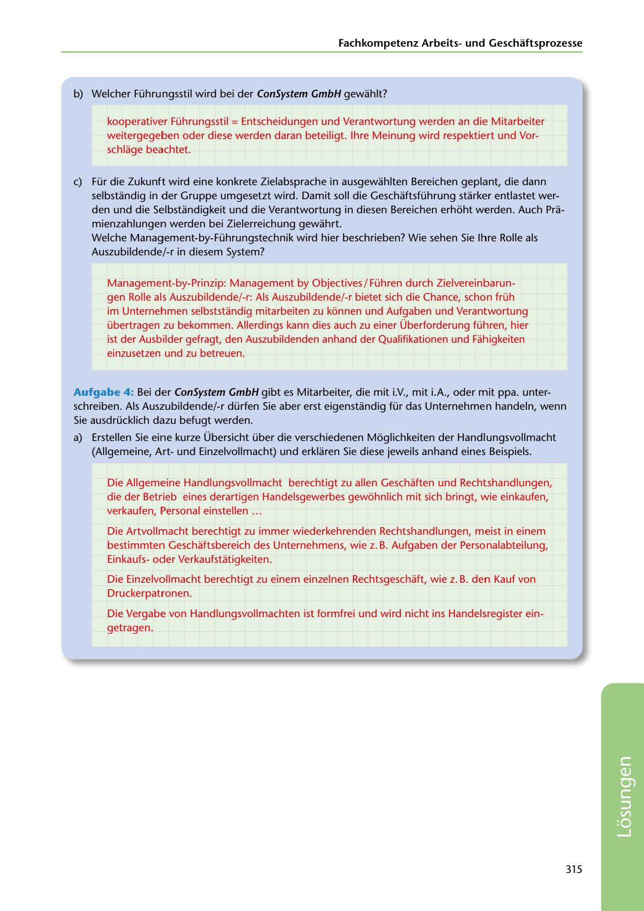

---
## Page 317
---

### Fachkornpetenz Arbeitsund Geschaftsprozesse

b) Welcher Führungsstil wird bei der ConSystem GmbH gewahlt?

kooperativer Führungsstil = Entscheidungen und Verantwortung werden an die Mitarbeiter weitergegeben oder diese werden daran beteiligt. lhre Meinung wird respektiert und Vor- schlage beachtet.

e) Für die Zukunft wird eine konkrete Zielabsprache in ausgewahlten Bereichen geplant, die dann selbstandig in der Gruppe umgesetzt wird. Damit soll die Geschaftsführung starker entlastet wer- den und die Selbstandigkeit und die Verantwortung in diesen Bereichen erhoht werden. Auch Pra- mienzahlungen werden bei Zielerreichung gewahrt. Welche Management-by-Führungstechnik wird hier beschrieben? Wie sehen Sie lhre Rolle als Auszubildende/-r in diesem System?

Management-by-Prinzip: Management by Objectives/ Führen durch Zielvereinbarun- gen Rolle als Auszubildende/-r: Als Auszubildende/-r bietet sich die Chance, schon früh im Unternehmen selbststandig mitarbeiten zu konnen und Aufgaben und Verantwortung übertragen zu bekommen. Allerdings kann dies auch zu einer Überforderung führen, hier ist der Ausbilder gefragt, den Auszubildenden anhand der Qualifikationen und Fahigkeiten einzusetzen und zu betreuen.

Aufgabe 4: Bei der ConSystem GmbH gibt es Mitarbeiter, die mit i.V., mit i.A., oder mit ppa. unter- schreiben. Als Auszubildende/-r dürfen Sie aber erst eigenstandig für das Unternehmen handeln, wenn Sie ausdrücklich dazu befugt werden.

a) Erstellen Sie eine kurze Übersicht über die verschiedenen Moglichkeiten der Handlungsvollmacht

(Allgemeine, Artund Einzelvollmacht) und erklaren Sie diese jeweils anhand eines Beispiels.

Die Allgemeine Handlungsvollmacht berechtigt zu allen Geschaften und Rechtshandlungen, die der Betrieb eines derartigen Handelsgewerbes gewohnlich mit sich bringt, wie einkaufen, verkaufen, Personal einstellen ...

Die Artvollmacht berechtigt zu immer wiederkehrenden Rechtshandlungen, meist in einem bestimmten Geschaftsbereich des Unternehmens, wie z. B. Aufgaben der Personalabteilung, Einkaufsoder Verkaufstatigkeiten.

Die Einzelvollmacht berechtigt zu einem einzelnen Rechtsgeschaft, wie z. B. den Kauf von Druckerpatronen.

Die Vergabe von Handlungsvollmachten ist formfrei und wird nicht ins Handelsregister ein- getragen.

315

<!-- IMAGE: page-317-img-1.jpeg - TODO: Add description -->
