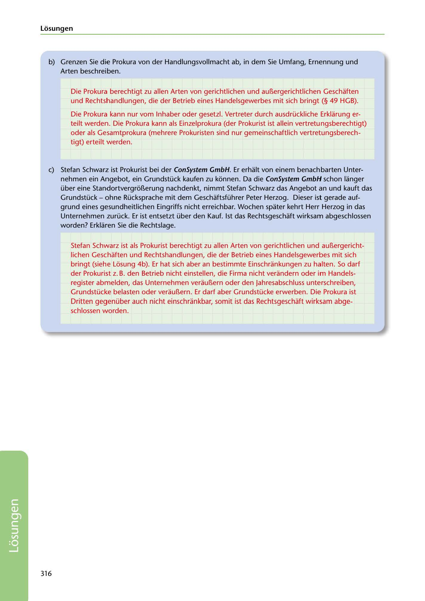

---
## Page 318
---

Losungen

b) Grenzen Sie die Prokura von der Handlungsvollmacht ab, in dem Sie Umfang, Ernennung und

Arten beschreiben.

Die Prokura berechtigt zu allen Arten von gerichtlichen und aur..ergerichtlichen Geschaften und Rechtshandlungen, die der Betrieb eines Handelsgewerbes mit sich bringt (§ 49 HGB).

Die Prokura kann nur vom lnhaber oder gesetzl. Vertreter durch ausdrückliche Erklarung er- teilt werden. Die Prokura kann als Einzelprokura (der Prokurist ist allein vertretungsberechtigt) oder als Gesamtprokura (mehrere Prokuristen sind nur gemeinschaftlich vertretungsberech- tigt) erteilt werden.

e) Stefan Schwarz ist Prokurist bei der ConSystem GmbH. Er erhalt von einem benachbarten Unter- nehmen ein Angebot, ein Grundstück kaufen zu konnen. Da die ConSystem GmbH schon langer über eine Standortvergro11erung nachdenkt, nimmt Stefan Schwarz das Angebot an und kauft das Grundstück - ohne Rücksprache mit dem Geschaftsführer Peter Herzog. Dieser ist gerade auf- grund eines gesundheitlichen Eingriffs nicht erreichbar. Wochen spater kehrt Herr Herzog in das Unternehmen zurück. Er ist entsetzt über den Kauf. 1st das Rechtsgeschaft wirksam abgeschlossen worden? Erklaren Sie die Rechtslage.

Stefan Schwarz ist als Prokurist berechtigt zu allen Arten von gerichtlichen und aur..ergericht- lichen Geschaften und Rechtshandlungen, die der Betrieb eines Handelsgewerbes mit sich bringt (siehe Losung 4b). Er hat sich aber an bestimmte Einschrankungen zu halten. So darf der Prokurist z. B. den Betrieb nicht einstellen, die Firma nicht verandern oder im Handels- register abmelden, das Unternehmen veraur..ern oder den Jahresabschluss unterschreiben, Grundstücke belasten oder veraul1ern. Er darf aber Grundstücke erwerben. Die Prokura ist Dritten gegenüber auch nicht einschrankbar, somit ist das Rechtsgeschaft wirksam abge- schlossen worden.

316

<!-- IMAGE: page-318-img-1.jpeg - TODO: Add description -->
