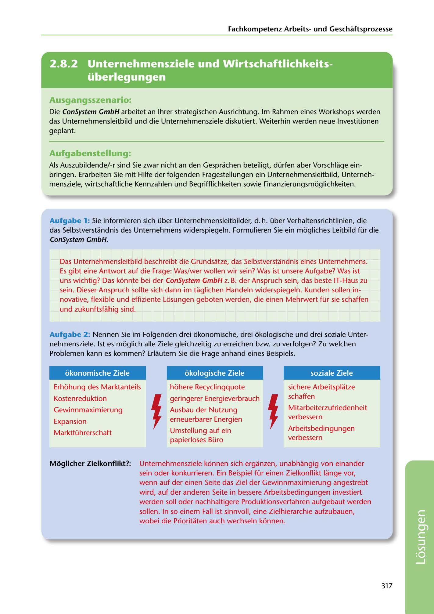

---
## Page 319
---

Fachkornpetenz Arbeitsund Geschaftsprozesse

<!-- IMAGE: page-319-img-1.jpeg - TODO: Add description -->

## Ausgangsszenario:

Die ConSystem GmbH arbeitet an lhrer strategischen Ausrichtung. lm Rahmen eines Workshops werden das Unternehmensleitbild und die Unternehmensziele diskutiert. Weiterhin werden neue lnvestitionen geplant.

## Aufgabenstellung:

Als Auszubildende/-r sind Sie zwar nicht an den Gesprachen beteiligt, dürfen aber Vorschlage ein- bringen. Erarbeiten Sie mit Hilfe der folgenden Fragestellungen ein Unternehmensleitbild, Unterneh- mensziele, wirtschaftliche Kennzahlen und Begrifflichkeiten sowie Finanzierungsmoglichkeiten.

### ConSystem GmbH.

Aufgabe 1: Sie informieren sich über Unternehmensleitbilder, d. h. über Verhaltensrichtlinien, die das Selbstverstandnis des Unternehmens widerspiegeln. Formulieren Sie ein mogliches Leitbild für die

Das Unternehrnensleitbild beschreibt die Grundsatze, das Selbstverstandnis eines Unternehmens. Es gibt eine Antwort auf die Frage: Was/wer wollen wir sein? Was ist unsere Aufgabe? Was ist uns wichtig? Das konnte bei der ConSystem GmbH z. B. der Anspruch sein, das beste IT-Haus zu sein. Dieser Anspruch sollte sich dann im taglichen Handeln widerspiegeln. Kunden sollen in- novative, flexible und effiziente Losungen geboten werden, die einen Mehrwert für sie schaffen und zukunftsfahig sind.

Aufgabe 2: Nennen Sie im Folgenden drei okonomische, drei okologische und drei soziale Unter- nehmensziele. 1st es moglich alle Ziele gleichzeitig zu erreichen bzw. zu verfolgen? Zu welchen Problemen kann es kommen? Erlautern Sie die Frage anhand eines Beispiels.

### okonomische Ziele

### okologische Ziele

### soziale Ziele

Erhohung des Marktanteils hohere Recyclingquote sichere Arbeitsplatze

schaffen

Gewinnmaximierung Ausbau der Nutzung Mitarbeiterzufriedenheit

Expansion erneuerbarer Energien verbessern

Marktführerschaft Umstellung auf ein Arbeitsbedingungen

papierloses Büro verbessern

# geringerer Energieverbrauch 1

# 1

Kostenreduktion

### Moglicher Zielko111flikt?:

Unternehmensziele konnen sich erganzen, unabhangig van einander sein oder konkurrieren. Ein Beispiel für einen Zielkonflikt lange vor, wenn auf der einen Seite das Ziel der Gewinnmaximierung angestrebt wird, auf der anderen Seite in bessere Arbeitsbedingungen investiert werden soll oder nachhaltigere Produktionsverfahren aufgebaut werden sallen. In so einem Fall ist sinnvoll, eine Zielhierarchie aufzubauen, wobei die Prioritaten auch wechseln konnen.

317

**[VISUAL: CONSYSTEM GMBH SOLUTION HEADER]**
Header image for the ConSystem GmbH corporate mission statement and goals solutions section.
