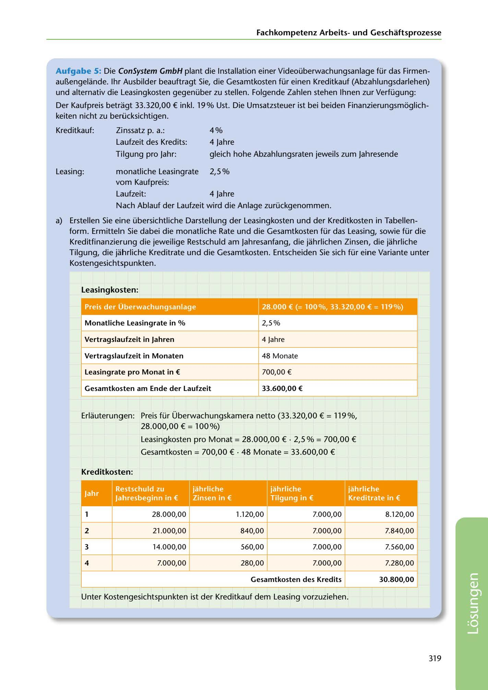

---
## Page 321
---

Fachkornpetenz Arbeitsund Geschaftsprozesse

Aufgabe 5: Die ConSystem GmbH plant die lnstallation einer Videoüberwachungsanlage für das Firmen- au~engelande. 1hr Ausbilder beauftragt Sie, die Gesamtkosten für einen Kreditkauf (Abzahlungsdarlehen) und alternativ die Leasingkosten gegenüber zu stellen. Folgende Zahlen stehen lhnen zur Verfügung:

Der Kaufpreis betragt 33.320,00 € inkl. 19% Ust. Die Umsatzsteuer ist bei beiden Finanzierungsmoglich- keiten nicht zu berücksichtigen.

Kreditkauf: Zinssatz p. a.: 4%

Laufzeit des Kredits: 4 Jahre

Tilgung pro Jahr: gleich hohe Abzahlungsraten jeweils zum Jahresende

Leasing:

monatliche Leasingrate 2,5 o/o vom Kaufpreis: Laufzeit: 4 Jahre Nach Ablauf der Laufzeit wird die Anlage zurückgenommen.

a) Erstellen Sie eine übersichtliche Darstellung der Leasingkosten und der Kreditkosten in Tabellen-

form. Ermitteln Sie dabei die monatliche Rate und die Gesamtkosten für das Leasing, sowie für die Kreditfinanzierung die jeweilige Restschuld am Jahresanfang, die jahrlichen Zinsen, die jahrliche Tilgung, die jahrliche Kreditrate und die Gesamtkosten. Entscheiden Sie sich für eine Variante unter Kostengesichtspunkten.

### Leasingkosten:

# .

-

<!-- IMAGE: page-321-img-1.jpeg - TODO: Add description -->

**[VISUAL: LEASING VS CREDIT FINANCING COMPARISON TABLES - SOLUTION]**
Two calculation tables comparing financing options for a video surveillance system: (1) Leasing table showing 2.5% monthly rate, 4-year term, €700 monthly payment, €33,600 total cost. (2) Credit (Abzahlungsdarlehen) table with 4% interest, showing yearly breakdown of Restschuld (remaining debt), Zinsen (interest), Tilgung (repayment), and Kreditrate (payment rate). Total credit cost €30,800 - demonstrating credit purchase is more economical.

2,5%

### M onatliche Leasingrate in %

4 Jahre

### Vertragslaufzeit in Jahren

48 Monate

### Vertragslaufzeit in Monaten

700,00 €

### Leasingrate pro Monat in €

### Gesamtkos.ten am Ende der Laufzeit

### 33.600,00 €

Erlauterungen: Preis für Überwachungskamera netto (33.320,00 € = 119%, 28.000,00 € = 100%)

Leasingkosten pro Monat = 28.000,00 € • 2,5 o/o= 700,00 €

Gesamtkosten = 700,00 € • 48 Monate = 33.600,00 €

### Kreditkosten:

**[VISUAL: LEASING VS CREDIT FINANCING COMPARISON TABLES - SOLUTION]**
Two calculation tables comparing financing options for a video surveillance system: (1) Leasing table showing 2.5% monthly rate, 4-year term, €700 monthly payment, €33,600 total cost. (2) Credit (Abzahlungsdarlehen) table with 4% interest, showing yearly breakdown of Restschuld (remaining debt), Zinsen (interest), Tilgung (repayment), and Kreditrate (payment rate). Total credit cost €30,800 - demonstrating credit purchase is more economical.

**[VISUAL: LEASING VS CREDIT FINANCING COMPARISON TABLES - SOLUTION]**
Two calculation tables comparing financing options for a video surveillance system: (1) Leasing table showing 2.5% monthly rate, 4-year term, €700 monthly payment, €33,600 total cost. (2) Credit (Abzahlungsdarlehen) table with 4% interest, showing yearly breakdown of Restschuld (remaining debt), Zinsen (interest), Tilgung (repayment), and Kreditrate (payment rate). Total credit cost €30,800 - demonstrating credit purchase is more economical.

**[VISUAL: LEASING VS CREDIT FINANCING COMPARISON TABLES - SOLUTION]**
Two calculation tables comparing financing options for a video surveillance system: (1) Leasing table showing 2.5% monthly rate, 4-year term, €700 monthly payment, €33,600 total cost. (2) Credit (Abzahlungsdarlehen) table with 4% interest, showing yearly breakdown of Restschuld (remaining debt), Zinsen (interest), Tilgung (repayment), and Kreditrate (payment rate). Total credit cost €30,800 - demonstrating credit purchase is more economical.

28.000,00 1.120,00 7.000,00

8.120,00

2

21.000,00 840,00 7.000,00

7.840,00

### 3

14.000,00 560,00 7.000,00

7.560,00

7.000,00 280,00 7.000,00

7.280,00

### 4

### Gesamtkosten des Kredits

### 30.800,00

Unter Kostengesichtspunkten ist der Kreditkauf dem Leasing vorzuziehen.

319

**[VISUAL: LEASING VS CREDIT FINANCING COMPARISON TABLES - SOLUTION]**
Two calculation tables comparing financing options for a video surveillance system: (1) Leasing table showing 2.5% monthly rate, 4-year term, €700 monthly payment, €33,600 total cost. (2) Credit (Abzahlungsdarlehen) table with 4% interest, showing yearly breakdown of Restschuld (remaining debt), Zinsen (interest), Tilgung (repayment), and Kreditrate (payment rate). Total credit cost €30,800 - demonstrating credit purchase is more economical.
