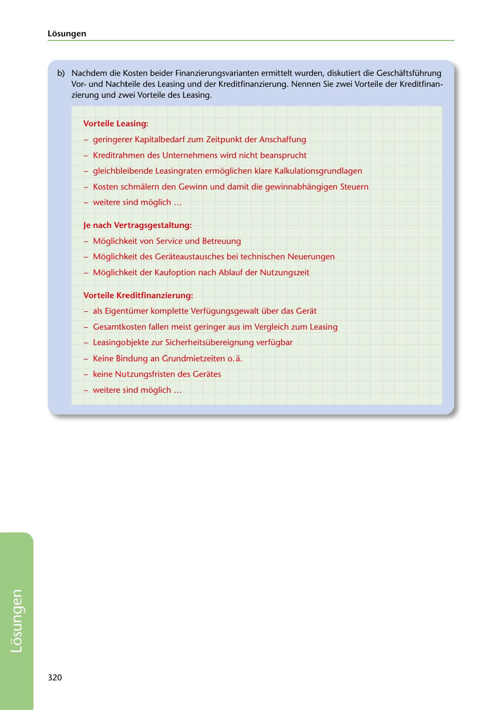

---
## Page 322
---

Losungen

b) Nachdem die Kosten beider Finanzierungsvarianten ermittelt wurden, diskutiert die Geschaftsführung Vorund Nachteile des Leasing und der Kreditfinanzierung. Nennen Sie zwei Vorteile der Kreditfinan- zierung und zwei Vorteile des Leasing.

### Vorteile Leasing:

- geringerer Kapitalbedarf zum Zeitpunkt der Anschaffung

- Kreditrahmen des Unternehmens wird nicht beansprucht

- gleichbleibende Leasingraten ermoglichen klare Kalkulationsgrundlagen

- Kosten schmalern den Gewinn und damit die gewinnabhangigen Steuern

- weitere sind moglich ...

### Je nach Vertragsgestaltung:

- Moglichkeit von Service und Betreuung

- Moglichkeit des Gerateaustausches bei technischen Neuerungen

- Moglichkeit der Kaufoption nach Ablauf der Nutzungszeit

### Vorteile Kreditfinanzierung:

- als Eigentümer komplette Verfügungsgewalt über das Gerat

- Gesamtkosten fallen meist geringer aus im Vergleich zum Leasing

- Leasingobjekte zur Sicherheitsübereignung verfügbar

- Keine Bindung an Grundmietzeiten o. a.

- keine Nutzungsfristen des Gerates

- weitere sind moglich ...

320

<!-- IMAGE: page-322-img-1.jpeg - TODO: Add description -->
