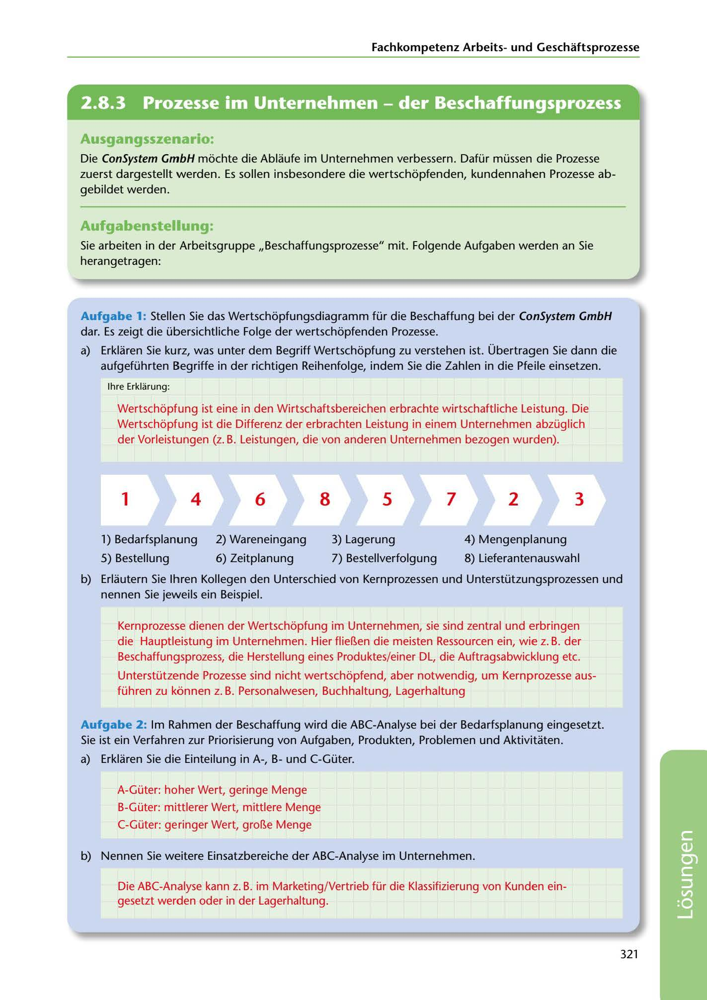

---
## Page 323
---

Fachkornpetenz Arbeitsund Geschaftsprozesse

<!-- IMAGE: page-323-img-1.jpeg - TODO: Add description -->

**[VISUAL: VALUE CHAIN DIAGRAM - PROCUREMENT PROCESS SOLUTION]**
A completed sequential arrow diagram showing the correct order of procurement process steps: 1 → 4 → 6 → 8 → 5 → 7 → 2 → 3, corresponding to: 1) Bedarfsplanung (demand planning), 4) Mengenplanung (quantity planning), 6) Zeitplanung (time planning), 8) Lieferantenauswahl (supplier selection), 5) Bestellung (order), 7) Bestellverfolgung (order tracking), 2) Wareneingang (goods receipt), 3) Lagerung (storage).

## Ausgangsszenario:

Die ConSystem GmbH mochte die Ablaufe im Unternehmen verbessern. Dafür müssen die Prozesse zuerst dargestellt werden. Es sollen insbesondere die wertschopfenden, kundennahen Prozesse ab- gebildet werden.

## Aufgabenstellung:

Sie arbeiten in der Arbeitsgruppe ,,Beschaffungsprozesse" mit. Folgende Aufgaben werden an Sie herangetragen:

Aufgabe 1: Stellen Sie das Wertschopfungsdiagramm für die Beschaffung bei der ConSystem GmbH dar. Es zeigt die übersichtliche Folge der wertschopfenden Prozesse.

a) Erklaren Sie kurz, was unter dem Begriff Wertschopfung zu verstehen ist. Übertragen Sie dann die aufgeführten Begriffe in der richtigen Reihenfolge, indem Sie die Zahlen in die Pfeile einsetzen.

lhre Erklarung:

Wertschopfung ist eine in den Wirtschaftsbereichen erbrachte wirtschaftliche Leistung. Die Wertschopfung ist die Differenz der erbrachten Leistung in einem Unternehmen abzüglich der Vorleistungen (z. B. Leistungen, die von anderen Unternehmen bezogen wurden).

# 1

# 4

# 6

# 8

# 5

# 7

# 2

# 3

**[VISUAL: VALUE CHAIN DIAGRAM - PROCUREMENT PROCESS SOLUTION]**
A completed sequential arrow diagram showing the correct order of procurement process steps: 1 → 4 → 6 → 8 → 5 → 7 → 2 → 3, corresponding to: 1) Bedarfsplanung (demand planning), 4) Mengenplanung (quantity planning), 6) Zeitplanung (time planning), 8) Lieferantenauswahl (supplier selection), 5) Bestellung (order), 7) Bestellverfolgung (order tracking), 2) Wareneingang (goods receipt), 3) Lagerung (storage).

**[VISUAL: VALUE CHAIN DIAGRAM - PROCUREMENT PROCESS SOLUTION]**
A completed sequential arrow diagram showing the correct order of procurement process steps: 1 → 4 → 6 → 8 → 5 → 7 → 2 → 3, corresponding to: 1) Bedarfsplanung (demand planning), 4) Mengenplanung (quantity planning), 6) Zeitplanung (time planning), 8) Lieferantenauswahl (supplier selection), 5) Bestellung (order), 7) Bestellverfolgung (order tracking), 2) Wareneingang (goods receipt), 3) Lagerung (storage).

1) Bedarfsplanung

2) Wareneingang

3) Lagerung 4) Mengenplanung

5) Bestellung

7) Bestellverfolgung 8) Lieferantenauswahl

6) Zeitplanung

b) Erlautern Sie lhren Kollegen den Unterschied von Kernprozessen und Unterstützungsprozessen und nennen Sie jeweils ein Beispiel.

Kernprozesse dienen der Wertschopfung im Unternehmen, sie sind zentral und erbringen die Hauptleistung im Unternehmen. Hier flier..en die meisten Ressourcen ein, wie z. B. der Beschaffungsprozess, die Herstellung eines Produktes/einer DL, die Auftragsabwicklung etc.

Unterstützende Prozesse sind nicht wertschopfend, aber notwendig, um Kernprozesse aus- führen zu kónnen z. B. Personalwesen, Buchhaltung, Lagerhaltung

Aufgabe 2: lm Rahmen der Beschaffung wird die ABC-Analyse bei der Bedarfsplanung eingesetzt. Sie ist ein Verfahren zur Priorisierung von Aufgaben, Produkten, Problemen und Aktivitaten.

a) Erklaren Sie die Einteilung in A-, Bund C-Güter.

A-Güter: hoher Wert, geringe Menge

B-Güter: mittlerer Wert, mittlere Menge

C-Güter: geringer Wert, gror..e Menge

b) Nennen Sie weitere Einsatzbereiche der ABC-Analyse im Unternehmen.

Die ABC-Analyse kann z. B. im Marketing/Vertrieb für die Klassifizierung von Kunden ein- gesetzt werden oder in der Lagerhaltung.

321

**[VISUAL: VALUE CHAIN DIAGRAM - PROCUREMENT PROCESS SOLUTION]**
A completed sequential arrow diagram showing the correct order of procurement process steps: 1 → 4 → 6 → 8 → 5 → 7 → 2 → 3, corresponding to: 1) Bedarfsplanung (demand planning), 4) Mengenplanung (quantity planning), 6) Zeitplanung (time planning), 8) Lieferantenauswahl (supplier selection), 5) Bestellung (order), 7) Bestellverfolgung (order tracking), 2) Wareneingang (goods receipt), 3) Lagerung (storage).
