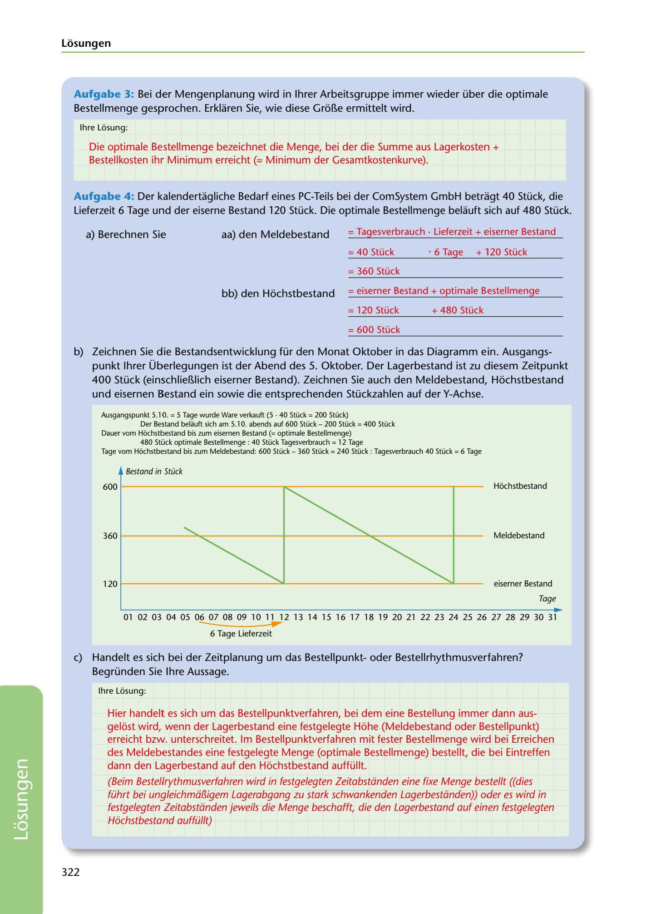

---
## Page 324
---

### Losungen

Aufgabe 3: Bei der Mengenplanung wird in lhrer Arbeitsgruppe immer wieder über die optimale Bestellmenge gesprochen. Erklaren Sie, wie diese Gr6Be ermittelt wird.

lhre Léisung:

Die optimale Bestellmenge bezeichnet die Menge, bei der die Summe aus Lagerkosten + Bestellkosten ihr Minimum erreicht (= Minimum der Gesamtkostenkurve).

Aufgabe 4: Der kalendertagliche Bedarf eines PC-Teils bei der ComSystem GmbH betragt 40 Stück, die Lieferzeit 6 Tage und der eiserne Bestand 120 Stück. Die optimale Bestellmenge belauft sich auf 480 Stück.

a) Berechnen Sie aa) den Meldebestand = Tagesverbrauch • Lieferzeit + eiserner Bestand

= 40 Stück • 6 Tage + 120 Stück

= 360 Stück

bb) den Hochstbestand = eiserner Bestand + optimale Bestellmenge

= 120 Stück + 480 Stück

= 600 Stück

b) Zeichnen Sie die Bestandsentwicklung für den Monat Oktober in das Diagramm ein. Ausgangs-

punkt lhrer Überlegungen ist der Abend des 5. Oktober. Der Lagerbestand ist zu diesem Zeitpunkt 400 Stück (einschlieBlich eiserner Bestand). Zeichnen Sie auch den Meldebestand, Hochstbestand

und eisernen Bestand ein sowie die entsprechenden Stückzahlen auf der Y-Achse.

Ausgangspunkt 5.1 O. = 5 Tage wurde Ware verkauft (5 • 40 Stück = 200 Stück) Der Bestand beliiuft sich am 5.1 O. abends auf 600 Stück - 200 Stück = 400 Stück Dauer vom Hochstbestand bis zum eisernen Bestand (= optimale Bestellmenge) 480 Stück optimale Bestellmenge : 40 Stück Tagesverbrauch = 12 Tage Tage vom Hochstbestand bis zum Meldebestand: 600 Stück - 360 Stück = 240 Stück : Tagesverbrauch 40 Stück = 6 Tage

Bestand in Stück

# 600 i--------------.....---------------,r---

Héichstbestand

Meldebestand

<!-- IMAGE: page-324-img-1.jpeg - TODO: Add description -->

eiserner Bestand

Tage

# -

# .....

01 02 03 04 05 06 07 08 09 10 11 12 13 14 15 16 17 18 19 20 21 22 23 24 25 26 27 28 29 30 31 6 Tage Lieferzeit

e) Handelt es sich bei der Zeitplanung um das Bestellpunktoder Bestellrhythmusverfahren?

Begründen Sie lhre Aussage.

lhre Léisung:

Hier handelt es sich um das Bestellpunktverfahren, bei dem eine Bestellung immer dann aus- gelost wird, wenn der Lagerbestand eine festgelegte Hohe (Meldebestand oder Bestellpunkt) erreicht bzw. unterschreitet. lm Bestellpunktverfahren mit fester Bestellmenge wird bei Erreichen des Meldebestandes eine festgelegte Menge (optimale Bestellmenge) bestellt, die bei Eintreffen dann den Lagerbestand auf den Hochstbestand auffüllt.

(Beim Bestellrythmusverfahren wird in festgelegten Zeitabstiinden eine fixe Menge bestellt ((dies führt bei ungleichmiifügem Lagerabgang zu stork schwankenden Lagerbestiinden)) oder es wird in festgelegten Zeitabstiinden jeweils die Menge beschafft, die den Lagerbestand auf einen festgelegten Hochstbestand auffüllt)

322

**[VISUAL: INVENTORY STOCK LEVEL DIAGRAM - SOLUTION]**
A line graph showing stock development (Bestandsentwicklung) for October with Y-axis showing stock in pieces (Stück) and X-axis showing days 01-31. Key levels marked: Höchstbestand (maximum stock) at 600, Meldebestand (reorder point) at 360, and eiserner Bestand (safety stock) at 120. Sawtooth pattern shows stock decline with reordering and 6-day delivery time indicated.
