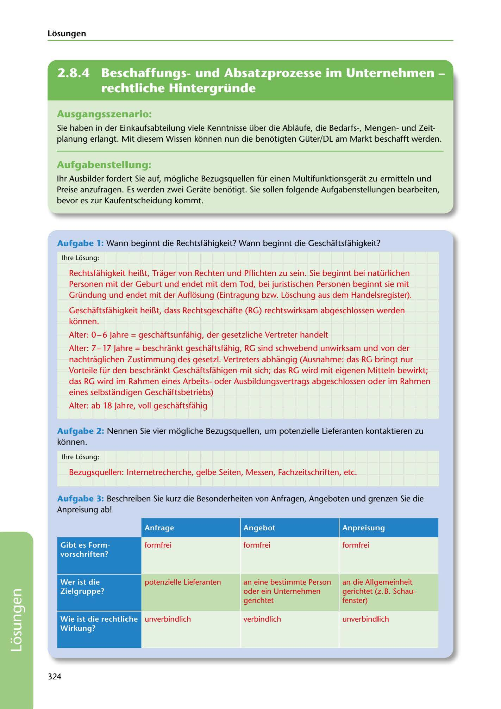

---
## Page 326
---

Losungen

<!-- IMAGE: page-326-img-1.jpeg - TODO: Add description -->

**[VISUAL: CONSYSTEM GMBH SOLUTION HEADER]**
Header image for the ConSystem GmbH procurement and legal capacity solutions section.

## Ausgangsszenario:

Sie haben in der Einkaufsabteilung viele Kenntnisse über die Ablaufe, die Bedarfs-, Mengenund Zeit- planung erlangt. Mit diesem Wissen konnen nun die benotigten Güter/DL am Markt beschafft werden.

## Aufgabenstellung.

1hr Ausbilder fordert Sie auf, mogliche Bezugsquellen für einen Multifunktionsgerat zu ermitteln und Preise anzufragen. Es werden zwei Gerate benotigt. Sie sallen folgende Aufgabenstellungen bearbeiten, bevor es zur Kaufentscheidung kommt.

Aufgabe 1: Wann beginnt die Rechtsfahigkeit? Wann beginnt die Geschaftsfahigkeit?

lhre Losung:

Rechtsfahigkeit hei~t, Trager von Rechten und Pflichten zu sein. Sie beginnt bei natürlichen Personen mit der Geburt und endet mit dem Tod, bei juristischen Personen beginnt sie mit Gründung und endet mit der Auflosung (Eintragung bzw. Loschung aus dem Handelsregister).

Geschaftsfahigkeit hei~t, dass Rechtsgeschafte (RG) rechtswirksam abgeschlossen werden konnen.

Alter: 0-6 Jahre = geschaftsunfahig, der gesetzliche Vertreter handelt

Alter: 7 - 17 Jahre = beschrankt geschaftsfahig, RG sind schwebend unwirksam und von der nachtraglichen Zustimmung des gesetzl. Vertreters abhangig (Ausnahme: das RG bringt nur Vorteile für den beschrankt Geschaftsfahigen mit sich; das RG wird mit eigenen Mitteln bewirkt; das RG wird im Rahmen eines Arbeitsoder Ausbildungsvertrags abgeschlossen oder im Rahmen eines selbstandigen Geschaftsbetriebs)

Alter: ab 18 Jahre, voll geschaftsfahig

Aufgabe 2: Nennen Sie vier mogliche Bezugsquellen, um potenzielle Lieferanten kontaktieren zu konnen.

lhre Losung:

Bezugsquellen: lnternetrecherche, gelbe Seiten, Messen, Fachzeitschriften, etc.

Aufgabe 3: Beschreiben Sie kurz die Besonderheiten von Anfragen, Angeboten und grenzen Sie die Anpreisung ab!

### Anfrage

### Angebot

### Anpreisung

formfrei

formfrei

formfrei

### Gibt es Form-

### vorschriften?

potenzielle Lieferanten

### Wer ist die

### Zielgruppe?

an eine bestimmte Person oder ein Unternehmen gerichtet

an die Allgemeinheit gerichtet (z. B. Schau- fenster)

unverbindlich

verbindlich

unverbindlich

### Wie ist die rechtliche

### Wirkung?

324

**[VISUAL: CONSYSTEM GMBH SOLUTION HEADER]**
Header image for the ConSystem GmbH procurement and legal capacity solutions section.
