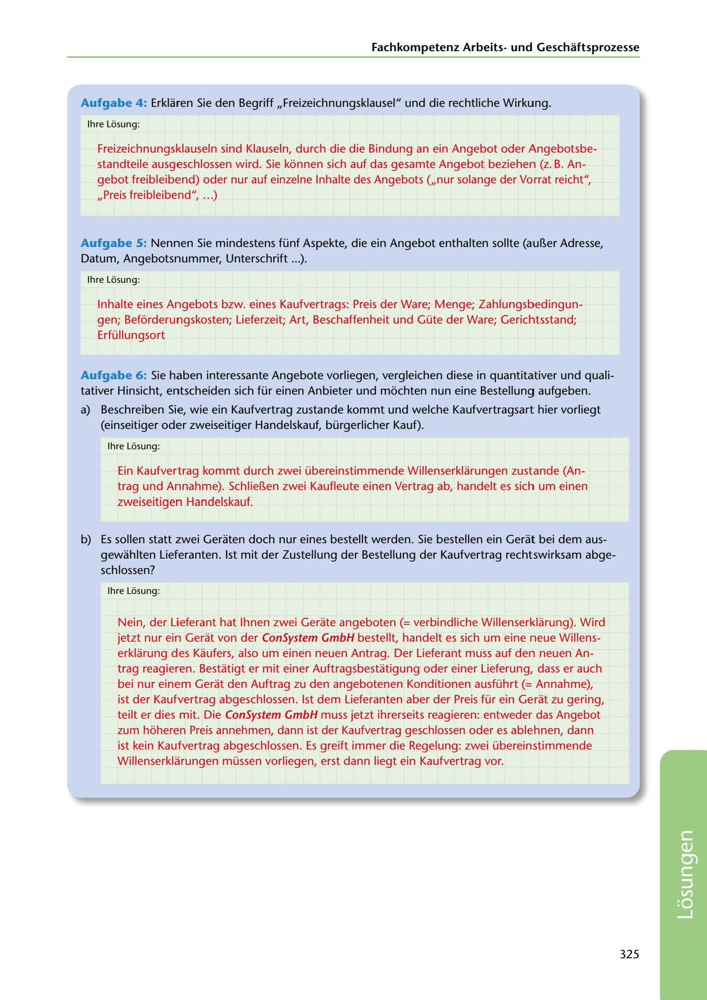

---
## Page 327
---

Fachkornpetenz Arbeitsund Geschaftsprozesse

Aufgabe 4: Erklaren Sie den Begriff ,,Freizeichnungsklausel" und die rechtliche Wirkung.

lhre Li:isung:

Freizeichnungsklauseln sind Klauseln, durch die die Bindung an ein Angebot oder Angebotsbe- standteile ausgeschlossen wird. Sie konnen sich auf das gesamte Angebot beziehen (z. B. An- gebot freibleibend) oder nur auf einzelne lnhalte des Angebots (,,nur solange der Vorrat reicht", ,,Preis freibleibend", ... )

Aufgabe 5: Nennen Sie mindestens fünf Aspekte, die ein Angebot enthalten sollte (aul1er Adresse, Datum, Angebotsnummer, Unterschrift ... ).

lhre Li:isung:

lnhalte eines Angebots bzw. eines Kaufvertrags: Preis der Ware; Menge; Zahlungsbedingun- gen; Befürderungskosten; Lieferzeit; Art, Beschaffenheit und Güte der Ware; Gerichtsstand; Erfüllungsort

Aufgabe 6: Sie haben interessante Angebote vorliegen, vergleichen diese in quantitativer und quali- tativer Hinsicht, entscheiden sich für einen Anbieter und mochten nun eine Bestellung aufgeben.

a) Beschreiben Sie, wie ein Kaufvertrag zustande kommt und welche Kaufvertragsart hier vorliegt (einseitiger oder zweiseitiger Handelskauf, bürgerlicher Kauf).

lhre Li:isung:

Ein Kaufvertrag kommt durch zwei übereinstimmende Willenserklarungen zustande (An- trag und Annahme). Schliel1en zwei Kaufleute einen Vertrag ab, handelt es sich um einen zweiseitigen Handelskauf.

b) Es sollen statt zwei Geraten doch nur eines bestellt werden. Sie bestellen ein Gerat bei dem aus- gewahlten Lieferanten. 1st mit der Zustellung der Bestellung der Kaufvertrag rechtswirksam abge- schlossen?

lhre Li:isung:

Nein, der Lieferant hat lhnen zwei Gerate angeboten (= verbindliche Willenserklarung). Wird jetzt nur ein Gerat von der ConSystem GmbH bestellt, handelt es sich um eine neue Willens- erklarung des Kaufers, also um einen neuen Antrag. Der Lieferant muss auf den neuen An- trag reagieren. Bestatigt er mit einer Auftragsbestatigung oder einer Lieferung, dass er auch bei nur einem Gerat den Auftrag zu den angebotenen Konditionen ausführt (= Annahme), ist der Kaufvertrag abgeschlossen. 1st dem Lieferanten aber der Preis für ein Gerat zu gering, teilt er dies mit. Die ConSystem GmbH muss jetzt ihrerseits reagieren: entweder das Angebot zum hoheren Preis annehmen, dann ist der Kaufvertrag geschlossen oder es ablehnen, dann ist kein Kaufvertrag abgeschlossen. Es greift immer die Regelung: zwei übereinstimmende Willenserklarungen müssen vorliegen, erst dann liegt ein Kaufvertrag vor.

325

<!-- IMAGE: page-327-img-1.jpeg - TODO: Add description -->
