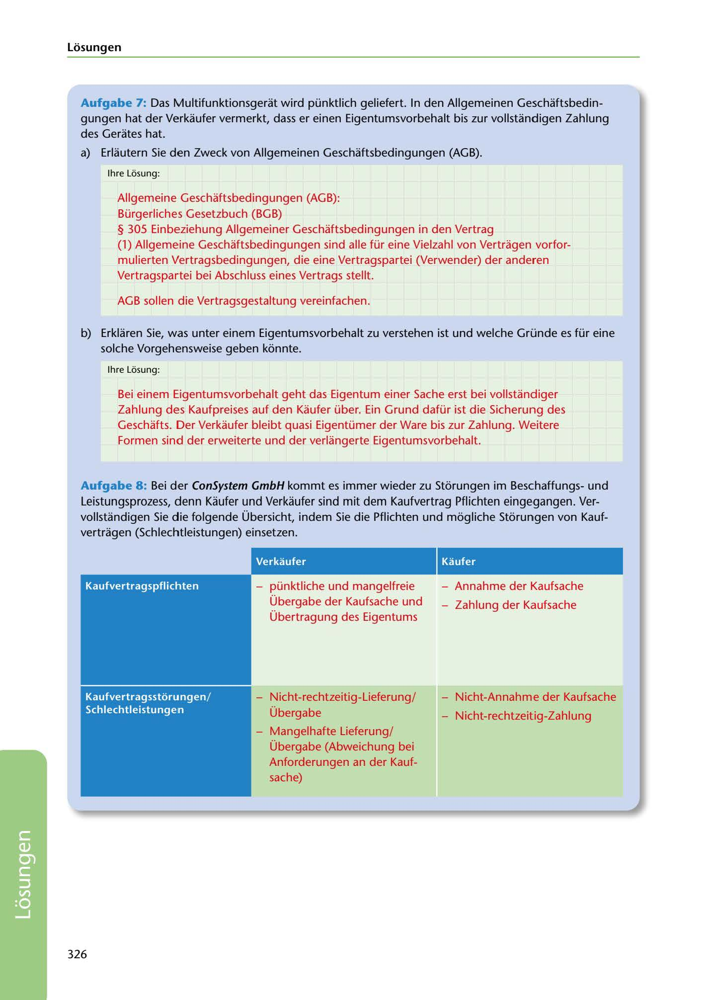

---
## Page 328
---

Losungen

Aufgabe 7: Das Multifunktionsgerat wird pünktlich geliefert. In den Allgemeinen Geschaftsbedin- gungen hat der Verkaufer vermerkt, dass er einen Eigentumsvorbehalt bis zur vollstandigen Zahlung des Gerates hat.

a) Erlautern Sie den Zweck von Allgemeinen Geschaftsbedingungen (AGB).

lhre Losung:

Allgemeine Geschaftsbedingungen (AGB): Bürgerliches Gesetzbuch (BGB) § 305 Einbeziehung Allgemeiner Geschaftsbedingungen in den Vertrag (1) Allgemeine Geschaftsbedingungen sind alle für eine Vielzahl von Vertragen vorfor- mulierten Vertragsbedingungen, die eine Vertragspartei (Verwender) der anderen Vertragspartei bei Abschluss eines Vertrags stellt.

AGB sollen die Vertragsgestaltung vereinfachen.

b) Erklaren Sie, was unter einem Eigentumsvorbehalt zu verstehen ist und welche Gründe es für eine

solche Vorgehensweise geben konnte.

lhre Losung:

Bei einem Eigentumsvorbehalt geht das Eigentum einer Sache erst bei vollstandiger Zahlung des Kaufpreises auf den Kaufer über. Ein Grund dafür ist die Sicherung des Geschafts. Der Verkaufer bleibt quasi Eigentümer der Ware bis zur Zahlung. Weitere Formen sind der erweiterte und der verlangerte Eigentumsvorbehalt.

Aufgabe 8: Bei der ConSystem GmbH kommt es immer wieder zu Storungen im Beschaffungsund Leistungsprozess, denn Kaufer und Verkaufer sind mit dem Kaufvertrag Pflichten eingegangen. Ver- vollstandigen Sie die folgende Übersicht, indem Sie die Pflichten und mogliche Storungen von Kauf- vertragen (Schlechtleistungen) einsetzen.

### Verkaufer

### Kaufer

### Kaufvertragspflichten

pünktliche und mangelfreie Annahme der Kaufsache Übergabe der Kaufsache und _ Zahlung der Kaufsache Übertragung des Eigentums

Nicht-rechtzeitig-Lieferung/ Nicht-Annahme der Kaufsache

### Kaufvertragsstorungen/

### Schlechtleistunge n

Übergabe - Nicht-rechtzeitig-Zahlung - Mangelhafte Lieferung/ Übergabe (Abweichung bei Anforderungen an der Kauf- sache)

326

<!-- IMAGE: page-328-img-1.jpeg - TODO: Add description -->
