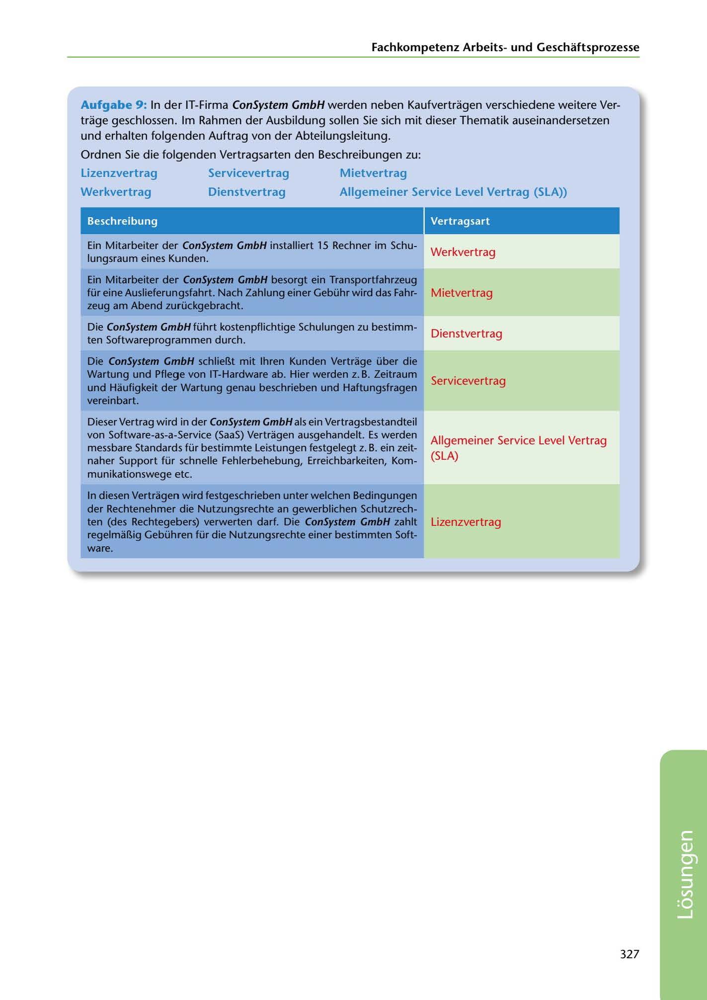

---
## Page 329
---

Fachkornpetenz Arbeitsund Geschaftsprozesse

Aufgabe 9: In der IT-Firrna ConSystem GmbH werden neben Kaufvertragen verschiedene weitere Ver- trage geschlossen. lrn Rahrnen der Ausbildung sollen Sie sich mit dieser Thematik auseinandersetzen und erhalten folgenden Auftrag von der Abteilungsleitung.

Ordnen Sie die folgenden Vertragsarten den Beschreibungen zu:

Mietvertrag Lizenzvertrag

Servicevertrag

Werkvertrag

Dienstvertrag Allgemeiner Service Level Vertrag (SLA))

Beschreibung

Vertragsart

Werkvertrag

Ein Mitarbeiter der ConSystem GmbH installiert 15 Rechner im Schu- lungsraum eines Kunden.

Mietvertrag

Ein Mitarbeiter der ConSystem GmbH besorgt ein Transportfahrzeug für eine Auslieferungsfahrt. Nach Zahlung einer Gebühr wird das Fahr- zeug am Abend zurückgebracht.

Dienstvertrag

Die ConSystem GmbH führt kostenpflichtige Schulungen zu bestimm- ten Softwareprogrammen durch.

Die ConSystem GmbH schlieBt mit lhren Kunden Vertrage über die Wartung und Pflege von IT-Hardware ab. Hier werden z. B. Zeitraum

Servicevertrag

und Haufigkeit der Wartung genau beschrieben und Haftungsfragen vereinbart.

Allgemeiner Service Level Vertrag (SLA)

Dieser Vertrag wird in der ConSystem GmbH als ein Vertragsbestandteil von Software-as-a-Service (SaaS) Vertragen ausgehandelt. Es werden messbare Standards für bestimmte Leistungen festgelegt z. B. ein zeit- naher Support für schnelle Fehlerbehebung, Erreichbarkeiten, Kom- munikationswege etc.

Lizenzvertrag

In diesen Vertragen wird festgeschrieben unter welchen Bedingungen der Rechtenehmer die Nutzungsrechte an gewerblichen Schutzrech- ten (des Rechtegebers) verwerten darf. Die ConSystem GmbH zahlt regelmaBig Gebühren für die Nutzungsrechte einer bestimmten Soft- ware.

327

<!-- IMAGE: page-329-img-1.jpeg - TODO: Add description -->
