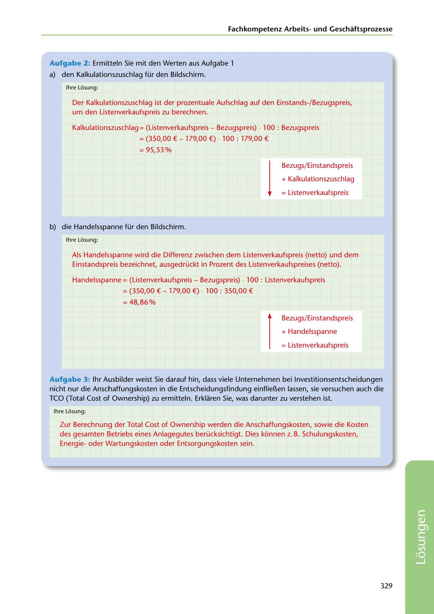

---
## Page 331
---

Fachkornpetenz Arbeitsund Geschaftsprozesse

### Aufgabe 2: Ermitteln Sie mit den Werten aus Aufgabe 1

a) den Kalkulationszuschlag für den Bildschirm.

lhre Losung:

Der Kalkulationszuschlag ist der prozentuale Aufschlag auf den Einstands-/Bezugspreis, um den Listenverkaufspreis zu berechnen.

Kalkulationszuschlag = (Listenverkaufspreis - Bezugspreis) · 100 : Bezugspreis

= (350,00 €-179,00 €) - 100: 179,00 €

= 95,53%

Bezugs/Einstandspreis

## = Listenverkaufspreis

+ Kalkulationszuschlag

# l

b) die Handelsspanne für den Bildschirm.

lhre Losung:

Als Handelsspanne wird die Differenz zwischen dem Listenverkaufspreis (netto) und dem

Einstandspreis bezeichnet, ausgedrückt in Prozent des Listenverkaufspreises (netto).

## Handelsspanne = (Listenverkaufspreis - Bezugspreis) - 100 : Listenverkaufspreis

## = 48,86%

= (350,00 € - 179,00 €) - 100 : 350,00 €

Bezugs/Einstandspreis

## = Listenverkaufspreis

+ Handelsspanne

# r

Aufgabe 3: 1hr Ausbilder weist Sie darauf hin, dass viele Unternehmen bei lnvestitionsentscheidungen nicht nur die Anschaffungskosten in die Entscheidungsfindung einflieBen lassen, sie versuchen auch die TCO (Total Cost of Ownership) zu ermitteln. Erklaren Sie, was darunter zu verstehen ist.

lhre Losung:

Zur Berechnung der Total Cost of Ownership werden die Anschaffungskosten, sowie die Kosten des gesamten Betriebs eines Anlagegutes berücksichtigt. Dies konnen z. B. Schulungskosten, Energieoder Wartungskosten oder Entsorgungskosten sein.

329

<!-- IMAGE: page-331-img-1.jpeg - TODO: Add description -->
