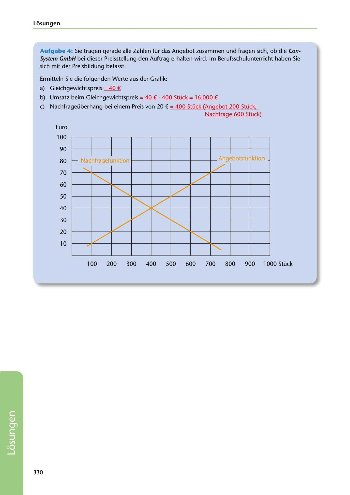

---
## Page 332
---

Losungen

Aufgabe 4: Sie tragen gerade alle Zahlen für das Angebot zusammen und fragen sich, ob die Con- System GmbH bei dieser Preisstellung den Auftrag erhalten wird. lm Berufsschulunterricht haben Sie sich mit der Preisbildung befasst.

Ermitteln Sie die folgenden Werte aus der Grafik:

a) Gleichgewichtspreis = 40 €

b) Umsatz beim Gleichgewichtspreis = 40 € • 400 Stück = 16.000 €

e) Nachfrageüberhang bei einem Preis van 20 € = 400 Stück (Angebot 200 Stück, Nachfrage 600 Stück)

Euro

100

90

1 1

-

....... :\lac'1traaetun~t

80

70

60

### "' 'Y LhJI.JIU 1 u,

# --

- -

50

40

30

-

# - ---

# -

# -

-

20

- -

10

# ,_ -

100 200 300 400 500 600 700 800 900 1000 Stück

330

<!-- IMAGE: page-332-img-1.jpeg - TODO: Add description -->
