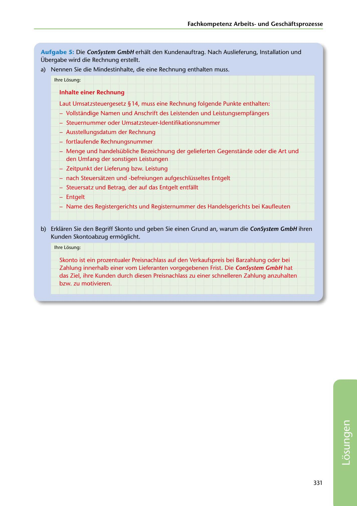

---
## Page 333
---

Fachkornpetenz Arbeitsund Geschaftsprozesse

Aufgabe 5: Die ConSystem GmbH erhalt den Kundenauftrag. Nach Auslieferung, lnstallation und Übergabe wird die Rechnung erstellt.

a) Nennen Sie die Mindestinhalte, die eine Rechnung enthalten muss.

lhre Losung:

### lnhalte einer Rechnung

Laut Umsatzsteuergesetz § 14, muss eine Rechnung folgende Punkte enthalten:

- Vollstandige Namen und Anschrift des Leistenden und Leistungsempfangers

- Steuernummer oder Umsatzsteuer-ldentifikationsnummer

- Ausstellungsdatum der Rechnung

- fortlaufende Rechnungsnummer

- Menge und handelsübliche Bezeichnung der gelieferten Gegenstande oder die Art und den Umfang der sonstigen Leistungen

- Zeitpunkt der Lieferung bzw. Leistung

- nach Steuersatzen und -befreiungen aufgeschlüsseltes Entgelt

- Steuersatz und Betrag, der auf das Entgelt entfallt

- Entgelt

- Name des Registergerichts und Registernummer des Handelsgerichts bei Kaufleuten

b) Erklaren Sie den Begriff Skonto und geben Sie einen Grund an, warum die ConSystem GmbH ihren Kunden Skontoabzug ermoglicht.

lhre Losung:

Skonto ist ein prozentualer Preisnachlass auf den Verkaufspreis bei Barzahlung oder bei Zahlung innerhalb einer vom Lieferanten vorgegebenen Frist. Die ConSystem GmbH hat das Ziel, ihre Kunden durch diesen Preisnachlass zu einer schnelleren Zahlung anzuhalten bzw. zu motivieren.

331

<!-- IMAGE: page-333-img-1.jpeg - TODO: Add description -->
