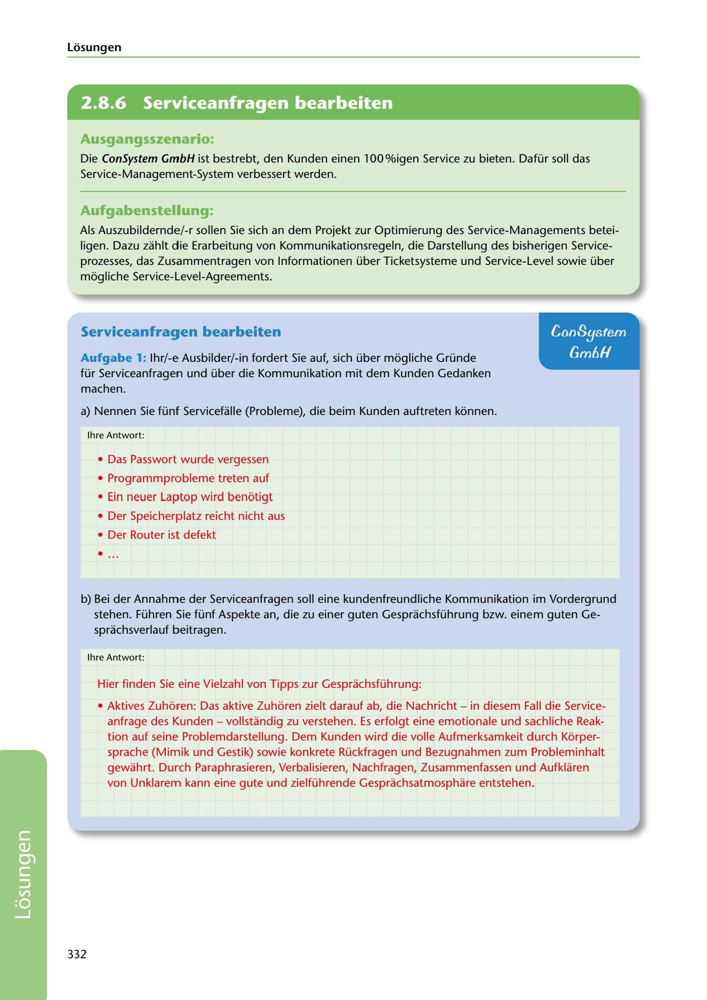

---
## Page 334
---

Losungen

<!-- IMAGE: page-334-img-1.jpeg - TODO: Add description -->

**[VISUAL: CONSYSTEM GMBH SOLUTION HEADER]**
Header image for the ConSystem GmbH service management optimization solutions section.

## Ausgangsszenario:

Die ConSystem GmbH ist bestrebt, den Kunden einen 100%igen Service zu bieten. Dafür soll das Service-Management-System verbessert werden.

## Aufgabenstellung:

Als Auszubildernde/-r sallen Sie sich an dem Projekt zur Optimierung des Service-Managements betei- ligen. Dazu zahlt die Erarbeitung von Kommunikationsregeln, die Darstellung des bisherigen Service- prozesses, das Zusammentragen von lnformationen über Ticketsysteme und Service-Level sowie über mogliche Service-Level-Agreements.

## Serviceanfragen bearbeiten

## ConSystem

## GmóH

Aufgabe 1: lhr/-e Ausbilder/-in fordert Sie auf, sich über mogliche Gründe für Serviceanfragen und über die Kommunikation mit dem Kunden Gedanken machen.

a) Nennen Sie fünf Servicefalle (Probleme), die beim Kunden auftreten konnen.

lhre Antwort:

• Das Passwort wurde vergessen

• Programmprobleme treten auf

• Ein neuer Laptop wird benotigt

• Der Speicherplatz reicht nicht aus

## •

• Der Router ist defekt

b) Bei der Annahme der Serviceanfragen soll eine kundenfreundliche Kommunikation im Vordergrund stehen. Führen Sie fünf Aspekte an, die zu einer guten Gesprachsführung bzw. einem guten Ge- sprachsverlauf beitragen.

lhre Antwort:

Hier finden Sie eine Vielzahl von Tipps zur Gesprachsführung:

• Aktives Zuhoren: Das aktive Zuhoren zielt darauf ab, die Nachricht - in diesem Fall die Service-

anfrage des Kunden - vollstandig zu verstehen. Es erfolgt eine emotionale und sachliche Reak- tion auf seine Problemdarstellung. Dem Kunden wird die volle Aufmerksamkeit durch Korper- sprache (Mimik und Gestik) sowie konkrete Rückfragen und Bezugnahmen zum Probleminhalt gewahrt. Durch Paraphrasieren, Verbalisieren, Nachfragen, Zusammenfassen und Aufklaren von Unklarem kann eine gute und zielführende Gesprachsatmosphare entstehen.

332

**[VISUAL: CONSYSTEM GMBH SOLUTION HEADER]**
Header image for the ConSystem GmbH service management optimization solutions section.
