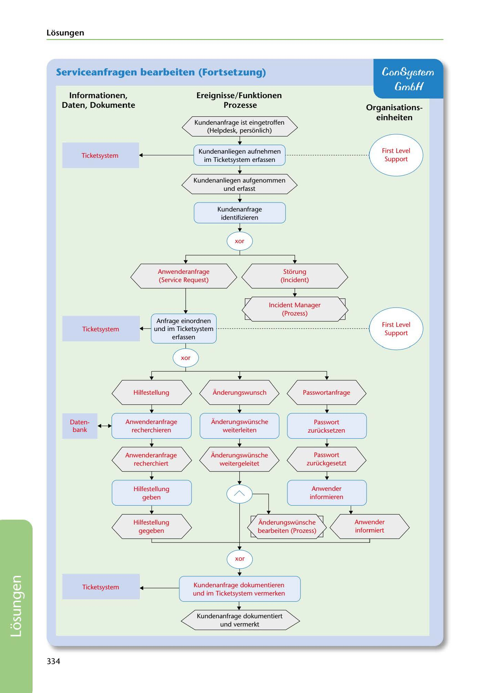

---
## Page 336
---

### Losungen

## ConSystem

## Serviceanfragen bearbeiten (Fortsetzung)

## GmóH

### lnformationen,

### Daten, Dokumente

### Ereignisse/ Funktionen

### Prozesse

### Organ isations-

### einheiten

Kundenanfrage ist eingetroffen (Helpdesk, persiinlich)

Ticketsystem

Kundenanliegen aufnehmen im Ticketsystem erfassen

<!-- IMAGE: page-336-img-1.jpeg - TODO: Add description -->

Kundenanliegen aufgenommen und erfasst

Kundenanfrage identifizieren

**[VISUAL: SERVICE REQUEST PROCESSING eEPK DIAGRAM - SOLUTION]**
A completed extended Event-driven Process Chain (eEPK) diagram with four columns: Informationen/Daten/Dokumente, Ereignisse/Funktionen, Prozesse, and Organisationseinheiten. Shows complete service request workflow: customer inquiry arrival → ticket system capture → request identification (branching to Anwenderanfrage, Störung, Änderungswunsch, Passwortanfrage) → corresponding actions (research, forward, password reset, help provision) → customer notification → documentation in ticket system.

Anwenderanfrage

(Service Request)

Stiirung (lncident)

lncident Manager

First Level

(Prozess) Anfrage einordnen und im Ticketsystem

Ticketsystem

Support

erfassen

**[VISUAL: SERVICE REQUEST PROCESSING eEPK DIAGRAM - SOLUTION]**
A completed extended Event-driven Process Chain (eEPK) diagram with four columns: Informationen/Daten/Dokumente, Ereignisse/Funktionen, Prozesse, and Organisationseinheiten. Shows complete service request workflow: customer inquiry arrival → ticket system capture → request identification (branching to Anwenderanfrage, Störung, Änderungswunsch, Passwortanfrage) → corresponding actions (research, forward, password reset, help provision) → customer notification → documentation in ticket system.

Hilfestellung

Ánderungswunsch Passwortanfrage

Daten- bank

Anwenderanfrage recherchieren

Ánderungswünsche Passwort weiterleiten zurücksetzen

Anwenderanfrage

recherchiert

Ánderungswünsche Passwort weitergeleitet zurückgesetzt

Anwender informieren

Hilfestellung geben

Hilfestellung

Anwender informiert

gegeben

Ánderungswünsche bearbeiten (Prozess)

**[VISUAL: SERVICE REQUEST PROCESSING eEPK DIAGRAM - SOLUTION]**
A completed extended Event-driven Process Chain (eEPK) diagram with four columns: Informationen/Daten/Dokumente, Ereignisse/Funktionen, Prozesse, and Organisationseinheiten. Shows complete service request workflow: customer inquiry arrival → ticket system capture → request identification (branching to Anwenderanfrage, Störung, Änderungswunsch, Passwortanfrage) → corresponding actions (research, forward, password reset, help provision) → customer notification → documentation in ticket system.

Ticketsystem

Kundenanfrage dokumentieren und im Ticketsystem vermerken

Kundenanfrage dokumentiert und vermerkt

334

**[VISUAL: SERVICE REQUEST PROCESSING eEPK DIAGRAM - SOLUTION]**
A completed extended Event-driven Process Chain (eEPK) diagram with four columns: Informationen/Daten/Dokumente, Ereignisse/Funktionen, Prozesse, and Organisationseinheiten. Shows complete service request workflow: customer inquiry arrival → ticket system capture → request identification (branching to Anwenderanfrage, Störung, Änderungswunsch, Passwortanfrage) → corresponding actions (research, forward, password reset, help provision) → customer notification → documentation in ticket system.
