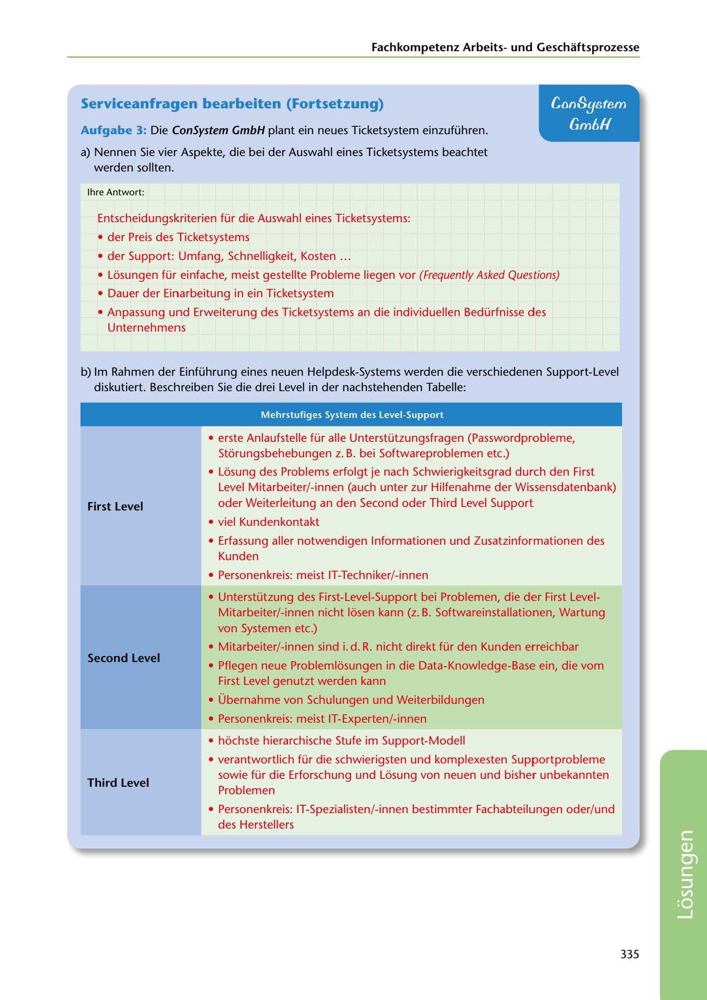

---
## Page 337
---

Fachkornpetenz Arbeitsund Geschaftsprozesse

### Serviceanfragen bearbeiten (Fortsetzung)

## ConSystem

## Gm6H

Aufgabe 3: Die ConSystem GmbH plant ein neues Ticketsystem einzuführen.

a) Nennen Sie vier Aspekte, die bei der Auswahl eines Ticketsystems beachtet

werden sollten.

lhre Antwort:

Entscheidungskriterien für die Auswahl eines Ticketsystems:

• der Preis des Ticketsystems

• der Support: Umfang, Schnelligkeit, Kosten ...

• Losungen für einfache, meist gestellte Probleme liegen vor (Frequently Asked Questions)

• Dauer der Einarbeitung in ein Ticketsystem

• Anpassung und Erweiterung des Ticketsystems an die individuellen Bedürfnisse des

Unternehmens

b) lm Rahmen der Einführung eines neuen Helpdesk-Systems werden die verschiedenen Support-Level

diskutiert. Beschreiben Sie die drei Level in der nachstehenden Tabelle:

Mehrstufiges System des Level-Support

• erste Anlaufstelle für alle Unterstützungsfragen (Passwordprobleme, Storungsbehebungen z. B. bei Softwareproblemen etc.)

• Losung des Problems erfolgt je nach Schwierigkeitsgrad durch den First Level Mitarbeiter/-innen (auch unter zur Hilfenahme der Wissensdatenbank) oder Weiterleitung an den Second oder Third Level Support

### First Level

• viel Kundenkontakt

• Erfassung aller notwendigen lnformationen und Zusatzinformationen des

Kunden

• Personenkreis: meist IT-Techniker/-innen

• Unterstützung des First-Level-Support bei Problemen, die der First Level-

Mitarbeiter/-innen nicht losen kann (z. B. Softwareinstallationen, Wartung von Systemen etc.)

• Mitarbeiter/-innen sind i. d. R. nicht direkt für den Kunden erreichbar

### Second Level

• Pflegen neue Problemlosungen in die Data-Knowledge-Base ein, die vom

First Level genutzt werden kann

• Übernahme von Schulungen und Weiterbildungen

• Personenkreis: meist IT-Experten/-innen

• hochste hierarchische Stufe im Support-Modell

• verantwortlich für die schwierigsten und komplexesten Supportprobleme

### Third Level

sowie für die Erforschung und Losung von neuen und bisher unbekannten Problemen

• Personenkreis: IT-Spezialisten/-innen bestimmter Fachabteilungen oder/und des Herstellers

335

<!-- IMAGE: page-337-img-1.jpeg - TODO: Add description -->
