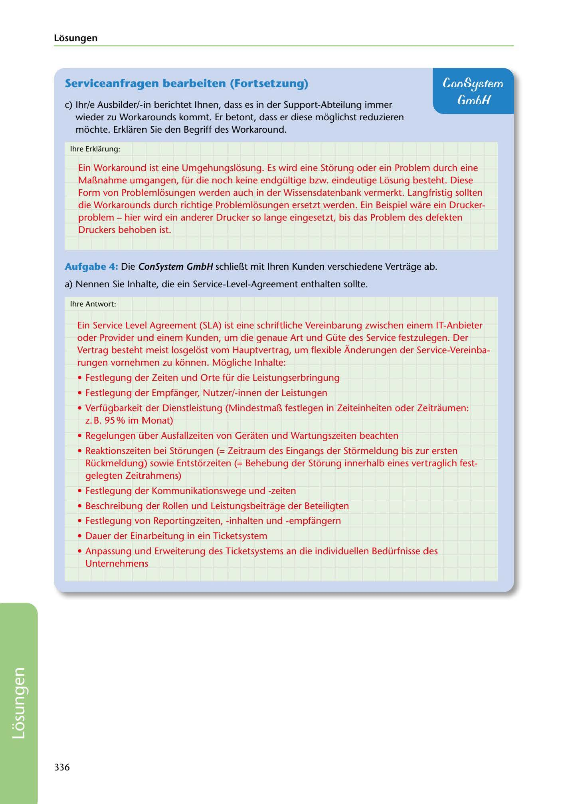

---
## Page 338
---

Losungen

### Serviceanfragen bearbeiten (Fortsetzung)

## ConSystem

## Gm6H

e) lhr/e Ausbilder/-in berichtet lhnen, dass es in der Support-Abteilung immer

wieder zu Workarounds kommt. Er betont, dass er diese moglichst reduzieren mochte. Erklaren Sie den Begriff des Workaround.

lhre Erklarung:

Ein Workaround ist eine Umgehungslosung. Es wird eine Storung oder ein Problem durch eine Mar..nahme umgangen, für die noch keine endgültige bzw. eindeutige Losung besteht. Diese Form von Problemlosungen werden auch in der Wissensdatenbank vermerkt. Langfristig sollten die Workarounds durch richtige Problemlosungen ersetzt werden. Ein Beispiel ware ein Drucker- problem - hier wird ein anderer Drucker so lange eingesetzt, bis das Problem des defekten Druckers behoben ist.

Aufgabe 4 : Die ConSystem GmbH schlier..t mit lhren Kunden verschiedene Vertrage ab.

a) Nennen Sie lnhalte, die ein Service-Level-Agreement enthalten sollte.

lhre Antwort:

Ein Service Level Agreement (SLA) ist eine schriftliche Vereinbarung zwischen einem IT-Anbieter oder Provider und einem Kunden, um die genaue Art und Güte des Service festzulegen. Der Vertrag besteht meist losgelost vom Hauptvertrag, um flexible Ánderungen der Service-Vereinba- rungen vornehmen zu konnen. Mogliche lnhalte:

• Festlegung der Zeiten und Orte für die Leistungserbringung

• Festlegung der Empfünger, Nutzer/-innen der Leistungen

• Verfügbarkeit der Dienstleistung (Mindestmar.. festlegen in Zeiteinheiten oder Zeitraumen: z. B. 95 % im Monat)

• Regelungen über Ausfallzeiten von Geraten und Wartungszeiten beachten

• Reaktionszeiten bei Storungen (= Zeitraum des Eingangs der Stormeldung bis zur ersten Rückmeldung) sowie Entstorzeiten (= Behebung der Storung innerhalb eines vertraglich fest- gelegten Zeitrahmens)

• Festlegung der Kommunikationswege und -zeiten

• Beschreibung der Rollen und Leistungsbeitrage der Beteiligten

• Festlegung von Reportingzeiten, -inhalten und -empfüngern

• Dauer der Einarbeitung in ein Ticketsystem

• Anpassung und Erweiterung des Ticketsystems an die individuellen Bedürfnisse des

Unternehmens

336

<!-- IMAGE: page-338-img-1.jpeg - TODO: Add description -->
