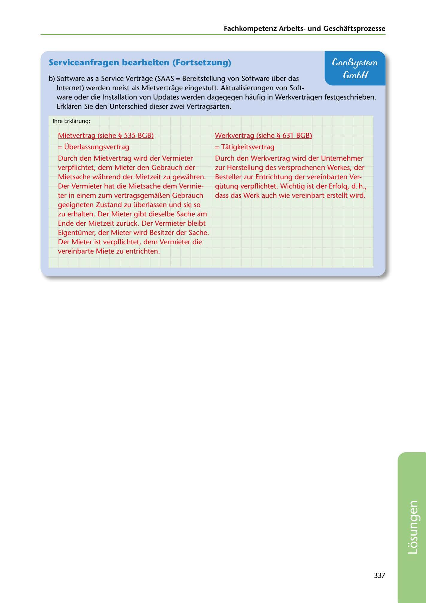

---
## Page 339
---

Fachkornpetenz Arbeitsund Geschaftsprozesse

### Serviceanfragen bearbeiten (Fortsetzung)

## ConSystem

## Gm6H

b) Software as a Service Vertrage (SAAS = Bereitstellung van Software über das

Internet) werden meist als Mietvertrage eingestuft. Aktualisierungen van Soft- ware oder die lnstallation van Updates werden dagegegen haufig in Werkvertragen festgeschrieben. Erklaren Sie den Unterschied dieser zwei Vertragsarten.

lhre Erklarung:

Werkvertrag (siehe § 631 BGB)

= Tatigkeitsvertrag

## = Überlassungsvertrag

Mietvertrag (siehe § 535 BGB)

Durch den Werkvertrag wird der Unternehmer zur Herstellung des versprochenen Werkes, der Besteller zur Entrichtung der vereinbarten Ver- gütung verpflichtet. Wichtig ist der Erfolg, d. h., dass das Werk auch wie vereinbart erstellt wird.

Durch den Mietvertrag wird der Vermieter verpflichtet, dem Mieter den Gebrauch der Mietsache wahirend der Mietzeit zu gewahren. Der Vermieter hat die Mietsache dem Vermie- ter in einem zum vertragsgema~en Gebrauch geeigneten Zustand zu überlassen und sie so zu erhalten. Der Mieter gibt dieselbe Sache am

Ende der Mietzeit zurück. Der Vermieter bleibt Eigentümer, der Mieter wird Besitzer der Sache. Der Mieter ist verpflichtet, dem Vermieter die vereinbarte Miete zu entrichten.

337

<!-- IMAGE: page-339-img-1.jpeg - TODO: Add description -->
