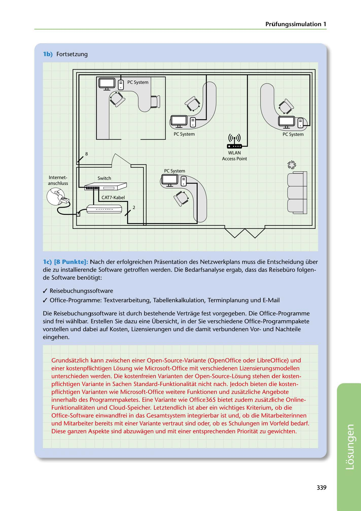

---
## Page 341
---

### Prüfungssimulation 1

### lb) Fortsetzung

<!-- IMAGE: page-341-img-1.jpeg - TODO: Add description -->

**[VISUAL: TRAVEL AGENCY NETWORK DIAGRAM - EXAM SIMULATION 1 SOLUTION]**
A complete network topology diagram for a travel agency showing: PC Systems connected via Switch, Internet connection through Router, WLAN Access Point for wireless connectivity, and various numbered connection points (1-8). Shows both wired and wireless (depicted with wave symbols) network segments.

PC System

PC System ((< >))

8

WLAN Access Point

**[VISUAL: TRAVEL AGENCY NETWORK DIAGRAM - EXAM SIMULATION 1 SOLUTION]**
A complete network topology diagram for a travel agency showing: PC Systems connected via Switch, Internet connection through Router, WLAN Access Point for wireless connectivity, and various numbered connection points (1-8). Shows both wired and wireless (depicted with wave symbols) network segments.

Internet- Switch

**[VISUAL: TRAVEL AGENCY NETWORK DIAGRAM - EXAM SIMULATION 1 SOLUTION]**
A complete network topology diagram for a travel agency showing: PC Systems connected via Switch, Internet connection through Router, WLAN Access Point for wireless connectivity, and various numbered connection points (1-8). Shows both wired and wireless (depicted with wave symbols) network segments.

2

**[VISUAL: TRAVEL AGENCY NETWORK DIAGRAM - EXAM SIMULATION 1 SOLUTION]**
A complete network topology diagram for a travel agency showing: PC Systems connected via Switch, Internet connection through Router, WLAN Access Point for wireless connectivity, and various numbered connection points (1-8). Shows both wired and wireless (depicted with wave symbols) network segments.

**[VISUAL: TRAVEL AGENCY NETWORK DIAGRAM - EXAM SIMULATION 1 SOLUTION]**
A complete network topology diagram for a travel agency showing: PC Systems connected via Switch, Internet connection through Router, WLAN Access Point for wireless connectivity, and various numbered connection points (1-8). Shows both wired and wireless (depicted with wave symbols) network segments.

**[VISUAL: TRAVEL AGENCY NETWORK DIAGRAM - EXAM SIMULATION 1 SOLUTION]**
A complete network topology diagram for a travel agency showing: PC Systems connected via Switch, Internet connection through Router, WLAN Access Point for wireless connectivity, and various numbered connection points (1-8). Shows both wired and wireless (depicted with wave symbols) network segments.

le) (8 Punkte]: Nach der erfolgreichen Prasentation des Netzwerkplans muss die Entscheidung über die zu installierende Software getroffen werden. Die Bedarfsanalyse ergab, dass das Reisebüro folgen- de Software benotigt:

✓ Reisebuchungssoftware

✓ Office-Prograrnme: Textverarbeitung, Tabellenkalkulation, Terminplanung und E-Mail

Die Reisebuchungssoftware ist durch bestehende Vertrage fest vorgegeben. Die Office-Programme sind freí wahlbar. Erstellen Sie dazu eine Übersicht, in der Sie verschiedene Office-Programmpakete vorstellen und dabei auf Kosten, Lizensierungen und die damit verbundenen Vorund Nachteile eingehen.

Grundsatzlich kann zwischen einer Open-Source-Variante (OpenOffice oder LibreOffice) und einer kostenpflichtigen Losung wie Microsoft-Office mit verschiedenen Lizensierungsmodellen unterschieden werden. Die kostenfreien Varianten der Open-Source-Losung stehen der kosten- pflichtigen Variante in Sachen Standard-Funktionalitat nicht nach. Jedoch bieten die kosten- pflichtigen Varianten wie Microsoft-Office weitere Funktionen und zusatzliche Angebote innerhalb des Programmpaketes. Eine Variante wie Office365 bietet zudem zusatzliche Online- Funktionalitaten und Cloud-Speicher. Letztendlich ist aber ein wichtiges Kriterium, ob die Office-Software einwandfrei in das Gesamtsystem integrierbar ist und, ob die Mitarbeiterinnen und Mitarbeiter bereits mit einer Variante vertraut sind oder, ob es Schulungen im Vorfeld bedarf. Diese ganzen Aspekte sind abzuwagen und mit einer entsprechenden Prioritat zu gewichten.

### 339

**[VISUAL: TRAVEL AGENCY NETWORK DIAGRAM - EXAM SIMULATION 1 SOLUTION]**
A complete network topology diagram for a travel agency showing: PC Systems connected via Switch, Internet connection through Router, WLAN Access Point for wireless connectivity, and various numbered connection points (1-8). Shows both wired and wireless (depicted with wave symbols) network segments.
