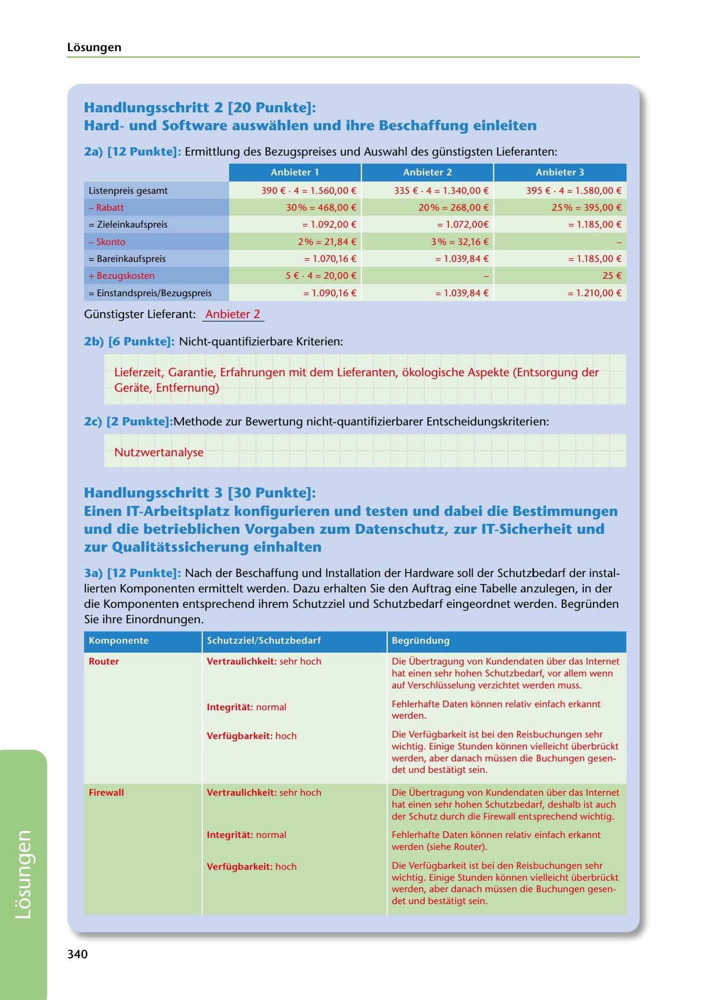

---
## Page 342
---

Losungen

## Handlungsschritt 2 [20 Punkte]:

### Hardund Software auswahlen und ihre Beschaffung einleiten

2a) (12 Punkte]: Ermittlung des Bezugspreises und Auswahl des günstigsten Lieferanten:

Anbieter 1

Anbieter 2

Anbieter 3

Listenpreis gesamt

### 390 € · 4 = 1.560,00 €

335 € · 4 = 1.340,00 €

395 € • 4 = 1.580,00 €

30% = 468,00 €

20% = 268,00 €

25 % = 395,00 €

= 1.092,00 €

= 1.072,00€

= 1.185,00 €

- Rabatt = Zieleinkaufspreis

- Skonto

2% = 21,84 €

3% = 32,16 €

= Bareinkaufspreis

=1 .070,16€

= 1.039,84 €

= 1.185,00 €

5 € • 4 = 20,00 €

25 €

= 1.090,16€

= 1.039,84 €

= 1.210,00 €

+ Bezugskosten = Einstandspreis/Bezugspreis

Günstigster Lieferant: Anbieter 2

### 2b) (6 Punkte]: Nicht-quantifizierbare Kriterien:

Lieferzeit, Garantie, Erfahrungen mit dem Lieferanten, ókologische Aspekte (Entsorgung der Gerate, Entfernung)

2c) (2 Punkte]:Methode zur Bewertung nicht-quantifizierbarer Entscheidungskriterien:

Nutzwertanalyse

## Handlungsschritt 3 [30 Punkte]:

## und die betrieblichen Vorgaben zum Datenschutz, zur IT-Sicherheit und

## zur Qualitatssicherung einhalten

Einen IT-Arbeitsplatz konfigurieren und testen und dabei die Bestimmungen

3a) (12 Punkte]: Nach der Beschaffung und lnstallation der Hardware soll der Schutzbedarf der instal- lierten Komponenten ermittelt werden. Dazu erhalten Sie den Auftrag eine Tabelle anzulegen, in der die Komponenten entsprechend ihrem Schutzziel und Schutzbedarf eingeordnet werden. Begründen Sie ihre Einordnungen.

### Komponente

### Schutzziel/ Schutzbedarf

### Begründung

### Router

### Vertraulichkeit: sehr hoch

Die Übertragung von Kundendaten über das Internet hat einen sehr hohen Schutzbedarf, vor allem wenn auf Verschlüsselung verzichtet werden muss.

### lntegritat: normal

Fehlerhafte Daten konnen relativ einfach erkannt werden.

### Verfügbarkeit: hoch

Die Verfügbarkeit ist bei den Reisbuchungen sehr wichtig. Einige Stunden konnen vielleicht überbrückt werden, aber danach müssen die Buchungen gesen- det und bestatigt sein.

### Firewall

### Vertraulichkeit: sehr hoch

Die Übertragung von Kundendaten über das Internet hat einen sehr hohen Schutzbedarf, deshalb ist auch der Schutz durch die Firewall entsprechend wichtig.

### lntegritat: normal

Fehlerhafte Daten konnen relativ einfach erkannt werden (siehe Router).

### Verfügbarkeit: hoch

Die Verfügbarkeit ist bei den Reisbuchungen sehr wichtig. Einige Stunden konnen vielleicht überbrückt werden, aber danach müssen die Buchungen gesen- det und bestatigt sein.

### 340

<!-- IMAGE: page-342-img-1.jpeg - TODO: Add description -->
