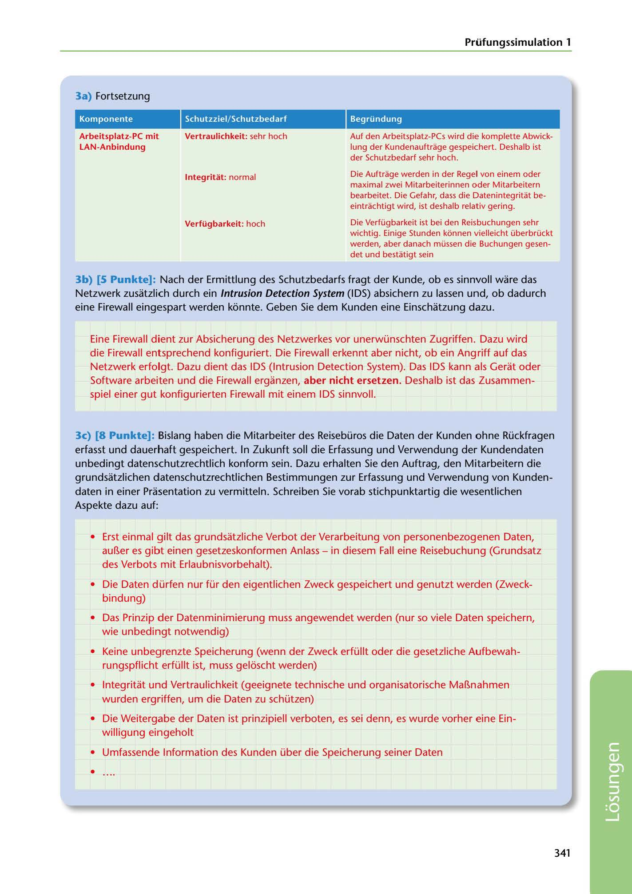

---
## Page 343
---

Prüfungssimulation 1

### 3a) Fortsetzung

Komponente

Schutzziel/ Schutzbedarf

### Begründung

### Vertraulichkeit: sehr hoch

### Arbeitsplatz-PC mil

### LAN-Anbindung

Auf den Arbeitsplatz-PCs wird die komplette Abwick- lung der Kundenauftrage gespeichert. Deshalb ist der Schutzbedarf sehr hoch.

### lntegritat: normal

Die Auftrage werden in der Regel von einem oder maximal zwei Mitarbeiterinnen oder Mitarbeitern bearbeitet. Die Gefahr, dass die Datenintegritat be- eintrachtigt wird, ist deshalb relativ gering.

### Verfügbarkeit: hoch

Die Verfügbarkeit ist bei den Reisbuchungen sehr wichtig. Einige Stunden konnen vielleicht überbrückt werden, aber danach müssen die Buchungen gesen- det und bestatigt sein

3b) (5 Punkte]: Nach der Ermittlung des Schutzbedarfs fragt der Kunde, ob es sinnvoll ware das Netzwerk zusatzlich durch ein lntrusion Detection System (IDS) absichern zu lassen und, ob dadurch eine Firewall eingespart werden konnte. Geben Sie dem Kunden eine Einschatzung dazu.

Eine Firewall dient zur Absicherung des Netzwerkes vor unerwünschten Zugriffen. Dazu wird die Firewall entsprechend konfiguriert. Die Firewall erkennt aber nicht, ob ein Angriff auf das Netzwerk erfolgt. Dazu dient das IDS (lntrusion Detection System). Das IDS kann als Gerat oder Software arbeiten und die Firewall erganzen, aber nicht ersetzen. Deshalb ist das Zusammen- spiel einer gut konfigurierten Firewall mit einem IDS sinnvoll.

3c) (8 Punkte]: Bislang haben die Mitarbeiter des Reisebüros die Daten der Kunden ohne Rückfragen erfasst und dauerhaft gespeichert. In Zukunft soll die Erfassung und Verwendung der Kundendaten unbedingt datenschutzrechtlich konform sein. Dazu erhalten Sie den Auftrag, den Mitarbeitern die grundsatzlichen datenschutzrechtlichen Bestimmungen zur Erfassung und Verwendung van Kunden- daten in einer Prasentation zu vermitteln. Schreiben Sie vorab stichpunktartig die wesentlichen Aspekte dazu auf:

• Erst einmal gilt das grundsatzliche Verbot der Verarbeitung van personenbezogenen Daten,

aul1er es gibt einen gesetzeskonformen Anlass - in diesem Fall eine Reisebuchung (Grundsatz des Verbots mit Erlaubnisvorbehalt).

• Die Daten dürfen nur für den eigentlichen Zweck gespeichert und genutzt werden (Zweck-

bindung)

• Das Prinzip der Datenminimierung muss angewendet werden (nur so viele Daten speichern, wie unbedingt notwendig)

• Keine unbegrenzte Speicherung (wenn der Zweck erfüllt oder die gesetzliche Aufbewah-

rungspflicht erfüllt ist, muss geloscht werden)

• lntegritat und Vertraulichkeit (geeignete technische und organisatorische Ma!1nahmen

wurden ergriffen, um die Daten zu schützen)

• Die Weitergabe der Daten ist prinzipiell verboten, es sei denn, es wurde vorher eine Ein- willigung eingeholt

## •

• Umfassende lnformation des Kunden über die Speicherung seiner Daten

### 341

<!-- IMAGE: page-343-img-1.jpeg - TODO: Add description -->
