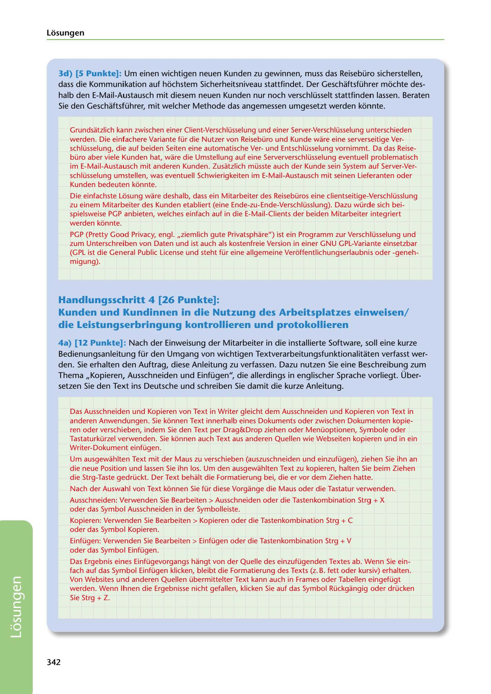

---
## Page 344
---

### Losungen

3d) [5 Punkte]: Um einen wichtigen neuen Kunden zu gewinnen, muss das Reisebüro sicherstellen, dass die Kommunikation auf hochstem Sicherheitsniveau stattfindet. Der Geschaftsführer mochte des- halb den E-Mail-Austausch mit diesem neuen Kunden nur noch verschlüsselt stattfinden lassen. Beraten Sie den Geschaftsführer, mit welcher Methode das angemessen umgesetzt werden konnte.

Grundsatzlich kann zwischen einer Client-Verschlüsselung und einer Server-Verschlüsselung unterschieden werden. Die einfachere Variante für die Nutzer von Reisebüro und Kunde ware eine serverseitige Ver- schlüsselung, die auf beiden Seiten eine automatische Verund Entschlüsselung vornimmt. Da das Reise-

büro aber viele Kunden hat, ware die Umstellung auf eine Serververschlüsselung eventuell problematisch im E-Mail-Austausch mit anderen Kunden. Zusatzlich müsste auch der Kunde sein System auf Server-Ver- schlüsselung umstellen, was eventuell Schwierigkeiten im E-Mail-Austausch mit seinen Lieferanten oder

Kunden bedeuten kónnte.

Die einfachste Losung ware deshalb, dass ein Mitarbeiter des Reisebüros eine clientseitige-Verschlüsslung zu einem Mitarbeiter des Kunden etabliert (eine Ende-zu-Ende-Verschlüsslung). Dazu würde sich bei- spielsweise PGP anbieten, welches einfach auf in die E-Mail-Clients der beiden Mitarbeiter integriert werden kónnte.

PGP (Pretty Good Privacy, engl. ,,ziemlich gute Privatsphare") ist ein Programm zur Verschlüsselung und zum Unterschreiben von Daten und ist auch als kostenfreie Version in einer GNU GPL-Variante einsetzbar (GPL ist die General Public License und steht für eine allgemeine Veróffentlichungserlaubnis oder -geneh- migung).

## Handlungsschritt 4 [26 Punkte]:

## Kunden und Kundinnen in die Nutzung des Arbeitsplatzes einweisen/

### die Leistungserbringung kontrollieren und protokollieren

4a) [12 Punkte]: Nach der Einweisung der Mitarbeiter in die installierte Software, soll eine kurze Bedienungsanleitung für den Umgang von wichtigen Textverarbeitungsfunktionalitaten verfasst wer- den. Sie erhalten den Auftrag, diese Anleitung zu verfassen. Dazu nutzen Sie eine Beschreibung zum Thema ,,Kopieren, Ausschneiden und Einfügen", die allerdings in englischer Sprache vorliegt. Über- setzen Sie den Text ins Deutsche und schreiben Sie damit die kurze Anleitung.

Das Ausschneiden und Kopieren von Text in Writer gleicht dem Ausschneiden und Kopieren von Text in anderen Anwendungen. Sie kónnen Text innerhalb eines Dokuments oder zwischen Dokumenten kopie- ren oder verschieben, indem Sie den Text per Drag&Drop ziehen oder Menüoptionen, Symbole oder Tastaturkürzel verwenden. Sie kónnen auch Text aus anderen Quellen wie Webseiten kopieren und in ein Writer-Dokument einfügen.

Um ausgewahlten Text mit der Maus zu verschieben (auszuschneiden und einzufügen), ziehen Sie ihn an die neue Position und lassen Sie ihn los. Um den ausgewahlten Text zu kopieren, halten Sie beim Ziehen die Strg-Taste gedrückt. Der Text behalt die Formatierung bei, die er vor dem Ziehen hatte.

Nach der Auswahl von Text kónnen Sie für diese Vorgange die Maus oder die Tastatur verwenden.

Ausschneiden: Verwenden Sie Bearbeiten > Ausschneiden oder die Tastenkombination Strg + X oder das Symbol Ausschneiden in der Symbolleiste.

Kopieren: Verwenden Sie Bearbeiten > Kopieren oder die Tastenkombination Strg + C oder das Symbol Kopieren.

Einfügen: Verwenden Sie Bearbeiten > Einfügen oder die Tastenkombination Strg + V oder das Symbol Einfügen.

Das Ergebnis eines Einfügevorgangs hangt von der Quelle des einzufügenden Textes ab. Wenn Sie ein- fach auf das Symbol Einfügen klicken, bleibt die Formatierung des Texts (z. B. fett oder kursiv) erhalten. Von Websites und anderen Quellen übermittelter Text kann auch in Frames oder Tabellen eingefügt werden. Wenn lhnen die Ergebnisse nicht gefallen, klicken Sie auf das Symbol Rückgangig oder drücken Sie Strg + Z.

### 342

<!-- IMAGE: page-344-img-1.jpeg - TODO: Add description -->
