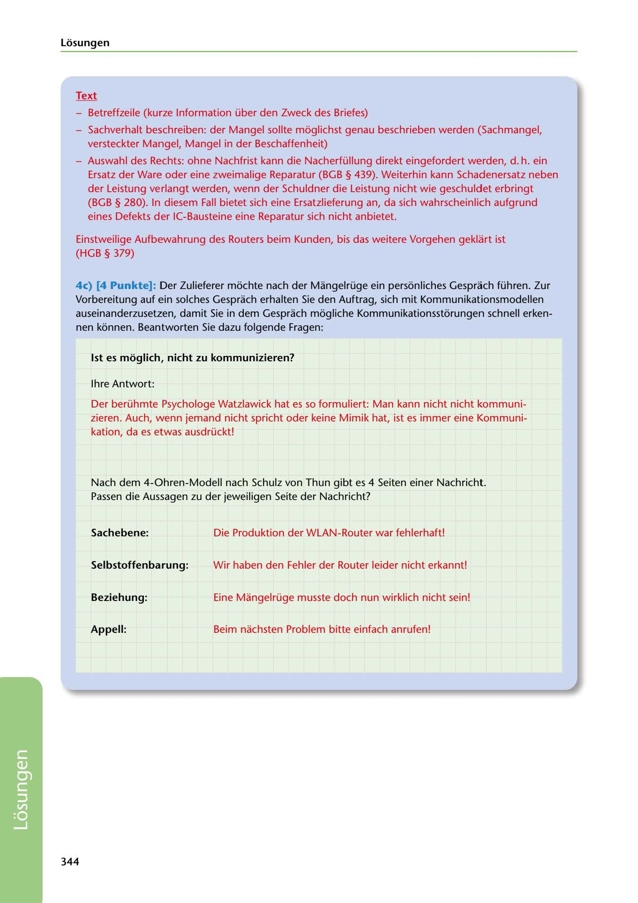

---
## Page 346
---

Losungen

### Text

- Betreffzeile (kuirze lnformation über den Zweck des Briefes)

- Sachverhalt beschreiben: der Mangel sollte moglichst genau beschrieben werden (Sachmangel, versteckter Mangel, Mangel in der Beschaffenheit)

- Auswahl des Rechts: ohne Nachfrist kann die Nacherfüllung direkt eingefordert werden, d. h. ein

Ersatz der Ware oder eine zweimalige Reparatur (BGB § 439). Weiterhin kann Schadenersatz neben der Leistung verlangt werden, wenn der Schuldner die Leistung nicht wie geschuldet erbringt (BGB § 280). In diesem Fall bietet sich eine Ersatzlieferung an, da sich wahrscheinlich aufgrund eines Defekts der IC-Bausteine eine Reparatur sich nicht anbietet.

Einstweilige Aufbewahrung des Routers beim Kunden, bis das weitere Vorgehen geklart ist (HGB § 379)

4c) (4 Punkte]: Der Zulieferer mochte nach der Mangelrüge ein personliches Gesprach führen. Zur Vorbereitung auf ein solches Gesprach erhalten Sie den Auftrag, sich mit Kommunikationsmodellen auseinanderzusetzen, damit Sie in dem Gesprach mogliche Kommunikationsstorungen schnell erken- nen konnen. Beantworten Sie dazu folgende Fragen:

### 1st es moglich, nicht zu kommunizieren?

lhre Antwort:

Der berühmte Psychologe Watzlawick hat es so formuliert: Man kann nicht nicht kommuni- zieren. Auch, wenn jemand nicht spricht oder keine Mimik hat, ist es immer eine Kommuni-

kation, da es etwas ausdrückt!

Nach dem 4-Ohren-Modell nach Schulz van Thun gibt es 4 Seiten einer Nachricht . Passen die Aussagen zu der jeweiligen Seite der Nachricht?

### Sachebene:

Die Produktion der WLAN-Router war fehlerhaft!

### Selbstoffenbarung:

Wir haben den Fehler der Router leider nicht erkannt!

### Beziehung:

Eine Mangelrüge musste doch nun wirklich nicht sein!

### Appell:

Beim nachsten Problem bitte einfach anrufen!

### 344

<!-- IMAGE: page-346-img-1.jpeg - TODO: Add description -->
