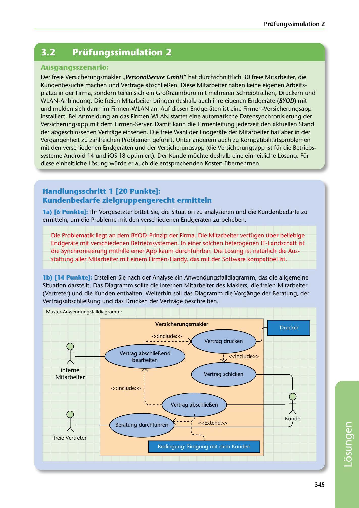

---
## Page 347
---

Prüfungssimulation 2

<!-- IMAGE: page-347-img-1.jpeg - TODO: Add description -->

### Ausgangsszenario:

Der freie Versicherungsmakler ,,Persona/Secure GmbH" hat durchschnittlich 30 freie Mitarbeiter, die Kundenbesuche machen und Vertrage abschlieí!.en. Diese Mitarbeiter haben keine eigenen Arbeits- platze in der Firma, sondern teilen sich ein Groí!.raumbüro mit mehreren Schreibtischen, Druckern und WLAN-Anbindung. Die freien Mitarbeiter bringen deshalb auch ihre eigenen Endgerate (BYOD) mit und melden sich dann im Firmen-WLAN an. Auf diesen Endgeraten ist eine Firmen-Versicherungsapp installiert. Bei Anmeldung an das Firmen-WLAN startet eine automatische Datensynchronisierung der Versicherungsapp mit dem Firmen-Server. Damit kann die Firmenleitung jederzeit den aktuellen Stand der abgeschlossenen Vertrage einsehen. Die freie Wahl der Endgerate der Mitarbeiter hat aber in der Vergangenheit zu zahlreichen Problemen geführt. Unter anderem auch zu Kompatibilitatsproblemen mit den verschiedenen Endgeraten und der Versicherungsapp (die Versicherungsapp ist für die Betriebs- systeme Android 14 und iOS 18 optimiert). Der Kunde mochte deshalb eine einheitliche Losung. Für diese einheitliche Losung würde er auch die entsprechenden Kosten übernehmen.

## Handlungsschritt 1 (20 Punkte]:

### Kundenbedarfe zielgruppengerecht ermitteln

la) [6 Punkte]: 1hr Vorgesetzter bittet Sie, die Situation zu analysieren und die Kundenbedarfe zu ermitteln, um die Probleme mit den verschiedenen Endgeraten zu beheben.

Die Problematik liegt an dem BYOD-Prinzip der Firma. Die Mitarbeiter verfügen über beliebige Endgerate mit verschiedenen Betriebssystemen. In einer solchen heterogenen IT-Landschaft ist die Synchronisierung mithilfe einer App kaum durchführbar. Die Losung ist natürlich die Aus- stattung aller Mitarbeiter mit einem Firmen-Handy, das mit der Software kompatibel ist.

lb) [14 Punkte]: Erstellen Sie nach der Analyse ein Anwendungsfalldiagramm, das die allgemeine Situation darstellt. Das Diagramm sollte die internen Mitarbeiter des Maklers, die freien Mitarbeiter (Vertreter) und die Kunden enthalten. Weiterhin soll das Diagramm die Vorgange der Beratung, der Vertragsabschlieí!.ung und das Drucken der Vertrage beschreiben.

Muster-Anwendungsfalldiagramm:

### Versicherungsmakler

Drucker

<<lnclude>>

' <<lnclude>> 1

# j-----+-t

**[VISUAL: UML USE CASE DIAGRAM - INSURANCE BROKER SYSTEM - EXAM SIMULATION 2]**
A complete UML use case diagram for an insurance broker (Versicherungsmakler) system. Shows system boundary with actors: interne Mitarbeiter (internal employees), freie Vertreter (freelance representatives), and Kunde (customer). Use cases include: Beratung (consultation), Vertragsabschluss (contract conclusion), Vertrag drucken (print contract) with Drucker actor. Relationships show <<Include>> and <<Extend>> stereotypes with condition "Einigung mit dem Kunden" (agreement with customer).

interne Mitarbeiter

**[VISUAL: UML USE CASE DIAGRAM - INSURANCE BROKER SYSTEM - EXAM SIMULATION 2]**
A complete UML use case diagram for an insurance broker (Versicherungsmakler) system. Shows system boundary with actors: interne Mitarbeiter (internal employees), freie Vertreter (freelance representatives), and Kunde (customer). Use cases include: Beratung (consultation), Vertragsabschluss (contract conclusion), Vertrag drucken (print contract) with Drucker actor. Relationships show <<Include>> and <<Extend>> stereotypes with condition "Einigung mit dem Kunden" (agreement with customer).

<<lnclude>> '

Kunde

, <<Extend>>

# j_

**[VISUAL: UML USE CASE DIAGRAM - INSURANCE BROKER SYSTEM - EXAM SIMULATION 2]**
A complete UML use case diagram for an insurance broker (Versicherungsmakler) system. Shows system boundary with actors: interne Mitarbeiter (internal employees), freie Vertreter (freelance representatives), and Kunde (customer). Use cases include: Beratung (consultation), Vertragsabschluss (contract conclusion), Vertrag drucken (print contract) with Drucker actor. Relationships show <<Include>> and <<Extend>> stereotypes with condition "Einigung mit dem Kunden" (agreement with customer).

freie Vertreter

Bedingung: Einigung mit dem Kunden

### 345

**[VISUAL: UML USE CASE DIAGRAM - INSURANCE BROKER SYSTEM - EXAM SIMULATION 2]**
A complete UML use case diagram for an insurance broker (Versicherungsmakler) system. Shows system boundary with actors: interne Mitarbeiter (internal employees), freie Vertreter (freelance representatives), and Kunde (customer). Use cases include: Beratung (consultation), Vertragsabschluss (contract conclusion), Vertrag drucken (print contract) with Drucker actor. Relationships show <<Include>> and <<Extend>> stereotypes with condition "Einigung mit dem Kunden" (agreement with customer).
