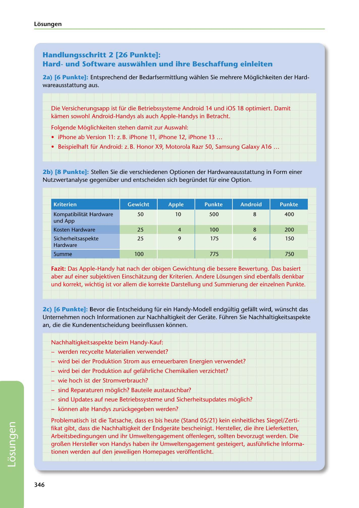

---
## Page 348
---

Losungen

## Handlungsschritt 2 [26 Punkte]:

### Hardund Software auswahlen und ihre Beschaffung einleiten

2a) [6 Punkte]: Entsprechend der Bedarfsermittlung wahlen Sie mehrere Moglichkeiten der Hard- wareausstattung aus.

Die Versicherungsapp ist für die Betriebssysteme Android 14 und iOS 18 optimiert. Damit kamen sowohl Android-Handys als auch Apple-Handys in Betracht.

Folgende Moglichkeiten stehen damit zur Auswahl:

• iPhone ab Version 11: z. B. iPhone 11, iPhone 12, iPhone 13 ...

• Beispielhaft für Android: z. B. Honor X9, Moto rola Razr 50, Samsung Galaxy A 16 ...

2b) [8 Punkte): Stellen Sie die verschiedenen Optionen der Hardwareausstattung in Form einer Nutzwertanalyse gegenüber und entscheiden sich begründet für eine Option.

### Punkte

Kriterien

<!-- IMAGE: page-348-img-1.jpeg - TODO: Add description -->

# ----tfM■

50

10 500 8

400

Kompatibilitat Hardware und App

Kosten Hardware

25

4

8

25

9 100

6

175

200 150

Sicherheitsaspekte Hardware

### Summe

775

100

750

Fazit: Das Apple-Handy hat nach der obigen Gewichtung die bessere Bewertung. Das basiert aber auf einer subjektiven Einschatzung der Kriterien. Andere Lósungen sind ebenfalls denkbar und korrekt, wichtig ist vor allem die korrekte Darstellung und Summierung der einzelnen Punkte.

2c) [6 Punkte]: Bevor die Entscheidung für ein Handy-Modell endgültig gefallt wird, wünscht das Unternehmen noch lnformationen zur Nachhaltigkeit der Gerate. Führen Sie Nachhaltigkeitsaspekte an, die die Kundenentscheidung beeinflussen konnen.

Nachhaltigkeitsaspekte beim Handy-Kauf:

- werden recycelte Materialien verwendet?

- wird bei der Produktion Strom aus erneuerbaren Energien verwendet?

- wird bei der Produktion auf gefahrliche Chemikalien verzichtet?

- wie hoch ist der Stromverbrauch?

- sind Reparaturen moglich? Bauteile austauschbar?

- sind Updates auf neue Betriebssysteme und Sicherheitsupdates moglich?

- konnen alte Handys zurückgegeben werden?

Problematisch ist die Tatsache, dass es bis heute (Stand 05/21) kein einheitliches Siegel/Zerti- fikat gibt, dass die Nachhaltigkeit der Endgerate bescheinigt. Hersteller, die ihre Lieferketten, Arbeitsbedingungen und ihr Umweltengagement offenlegen, sollten bevorzugt werden. Die groí!.en Hersteller van Handys haben ihr Umweltengagement gesteigert, ausführliche lnforma- tionen werden auf den jeweiligen Homepages veroffentlicht.

### 346

**[VISUAL: UTILITY VALUE ANALYSIS TABLE - MOBILE DEVICE SELECTION - EXAM SIMULATION 2]**
A completed utility value analysis (Nutzwertanalyse) comparing Apple iPhone vs Android devices (Honor, Motorola, Samsung) for insurance broker mobile deployment. Criteria include: Kompatibilität Hardware und App (50%), Kosten Hardware (25%), Sicherheitsaspekte Hardware (25%). Final scores: iPhone 775 points, Android 750 points - demonstrating iPhone as preferred choice.
