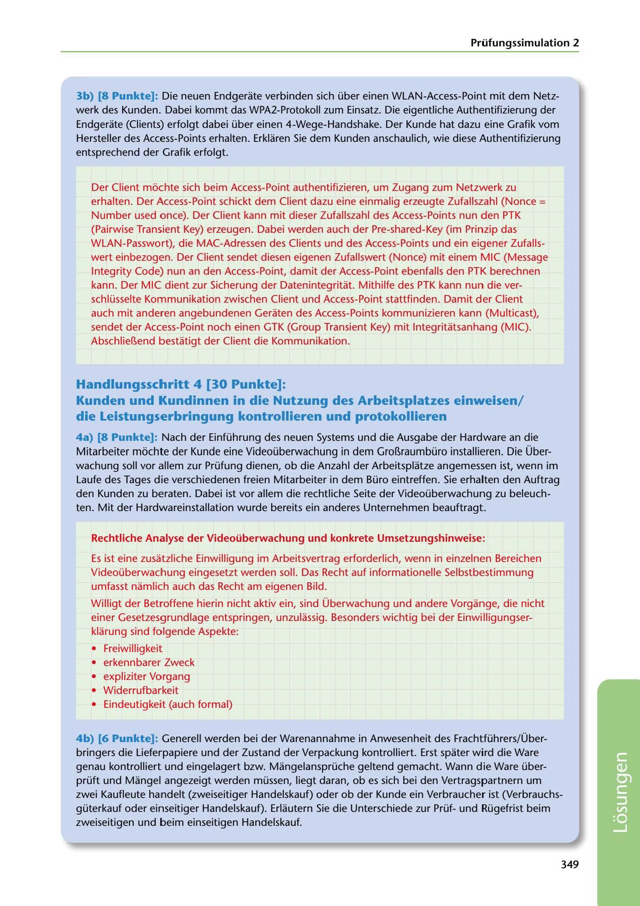

---
## Page 351
---

Prüfungssimulation 2

3b) (8 Punkte]: Die neuen Endgerate verbinden sich über einen WLAN-Access-Point mit dem Netz- werk des Kunden. Dabei kommt das WPA2-Protokoll zum Einsatz. Die eigentliche Authentifizierung der Endgerate (Clients) erfolgt dabei über einen 4-Wege-Handshake. Der Kunde hat dazu eine Grafik vom Hersteller des Access-Points erhalten. Erklaren Sie dem Kunden anschaulich, wie diese Authentifizierung entsprechend der Grafik erfolgt.

Der Client móchte sich beim Access-Point authentifizieren, um Zugang zum Netzwerk zu erhalten. Der Access-Point schickt dem Client dazu eine einmalig erzeugte Zufallszahl (Nonce = Number used once). Der Client kann mit dieser Zufallszahl des Access-Points nun den PTK (Pairwise Transient Key) erzeugen. Dabei werden auch der Pre-shared-Key (im Prinzip das WLAN-Passwort), die MAC-Adressen des Clients und des Access-Points und ein eigener Zufalls- wert einbezogen. Der Client sendet diesen eigenen Zufallswert (Nonce) mit einem MIC (Message

lntegrity Code) nun an den Access-Point, damit der Access-Point ebenfalls den PTK berechnen kann. Der MIC dient zur Sicherung der Datenintegritat. Mithilfe des PTK kann nun die ver- schlüsselte Kommunikation zwischen Client und Access-Point stattfinden. Damit der Client auch mit anderen angebundenen Geraten des Access-Points kommunizieren kann (Multicast), sendet der Access-Point noch einen GTK (Group Transient Key) mit lntegritatsanhang (MIC). Abschlier..end bestatigt der Client die Kommunikation.

## Handlungsschritt 4 (30 Punkte]:

### die Leistungserbringung kontrollieren und protokollieren

Kunden und Kundinnen in die Nutzung des Arbeitsplatzes einweisen/

4a) (8 Punkte]: Nach der Einführung des neuen Systems und die Ausgabe der Hardware an die Mitarbeiter mochte der Kunde eine Videoüberwachung in dem Gror..raumbüro installieren. Die Über- wachung soll vor allem zur Prüfung dienen, ob die Anzahl der Arbeitsplatze angemessen ist, wenn im Laufe des Tages die verschiedenen freien Mitarbeiter in dem Büro eintreffen. Sie erhalten den Auftrag den Kunden zu beraten. Dabei ist vor allem die rechtliche Seite der Videoüberwachung zu beleuch- ten. Mit der Hardwareinstallation wurde bereits ein anderes Unternehmen beauftragt.

Rechtliche Analyse der Videoüberwachung und konkrete Umsetzungshinweise:

Es ist eine zusatzliche Einwilligung im Arbeitsvertrag erforderlich, wenn in einzelnen Bereichen Videoüberwachung eingesetzt werden soll. Das Recht auf informationelle Selbstbestimmung

umfasst namlich auch das Recht am eigenen Bild.

Willigt der Betroffene hierin nicht aktiv ein, sind Überwachung und andere Vorgange, die nicht einer Gesetzesgrundlage entspringen, unzulassig. Besonders wichtig bei der Einwilligungser- klarung sind folgende Aspekte:

• Freiwilligkeit • erkennbarer Zweck • expliziter Vorgang • Widerrufbarkeit • Eindeutigkeit (auch formal)

4b) (6 Punkte]: Generell werden bei der Warenannahme in Anwesenheit des Frachtführers/ Über- bringers die Lieferpapiere und der Zustand der Verpackung kontrolliert. Erst spater wird die Ware genau kontrolliert und eingelagert bzw. Mangelansprüche geltend gemacht. Wann die Ware über- prüft und Mangel angezeigt werden müssen, liegt daran, ob es sich bei den Vertragspartnern um zwei Kaufleute handelt (zweiseitiger Handelskauf) oder ob der Kunde ein Verbraucher ist (Verbrauchs- güterkauf oder einseitiger Handelskauf). Erlautern Sie die Unterschiede zur Prüfund Rügefrist beim zweiseitigen und beim einseitigen Handelskauf.

### 349

<!-- IMAGE: page-351-img-1.jpeg - TODO: Add description -->
