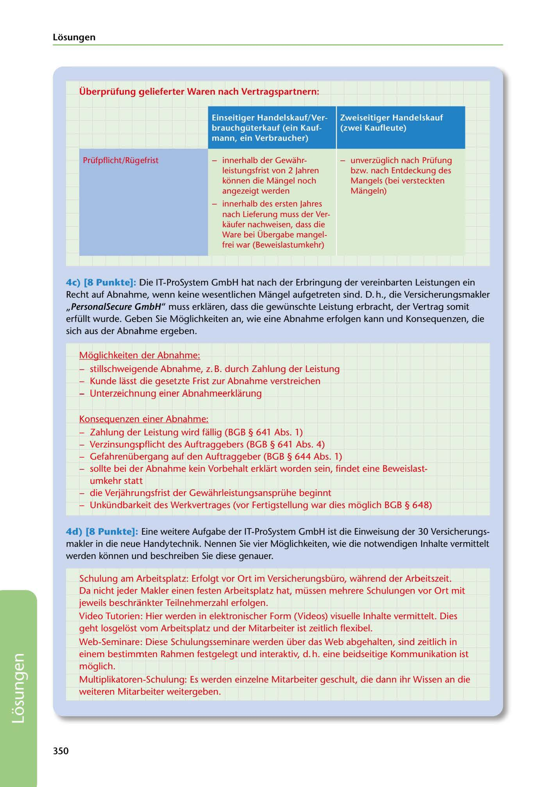

---
## Page 352
---

Losungen

Überprüfung gelieferter Waren nach Vertragspartnern:

'

### Zweiseitiger Handelskauf

### (zwei Kaufleute)

### Einseitiger Handelskauf/ Ver-

### brauchgüterkauf (ein Kauf-

### mann, ein Verbraucher)

Prüfpfl icht/Rü g efrist

- innerhalb der Gewahr- leistungsfrist von 2 Jahren konnen die Mangel noch angezeigt werden

- unverzüglich nach Prüfung bzw. nach Entdeckung des Mangels (bei versteckten Mangeln)

- innerhalb des ersten Jahres nach Lieferung muss der Ver- kaufer nachweisen, dass die Ware bei Übergabe mangel- frei war (Beweislastumkehr)

<!-- IMAGE: page-352-img-1.jpeg - TODO: Add description -->

4c) (8 Punkte]: Die IT-ProSystem GmbH hat nach der Erbringung der vereinbarten Leistungen ein

Recht auf Abnahme, wenn keine wesentlichen Mangel aufgetreten sind. D. h., die Versicherungsmakler ,,Persona/Secure GmbH" muss erklaren, dass die gewünschte Leistung erbracht, der Vertrag somit erfüllt wurde. Geben Sie Moglichkeiten an, wie eine Abnahme erfolgen kann und Konsequenzen, die sich aus der Abnahme ergeben.

Moglichkeiten der Abnahme:

- stillschweigende Abnahme, z. B. durch Zahlung der Leistung - Kunde lasst die gesetzte Frist zur Abnahme verstreichen - Unterzeichnung einer Abnahmeerklarung

Konsequenzen einer Abnahme: - Zahlung der Leistung wird fallig (BGB § 641 Abs. 1) - Verzinsungspflicht des Auftraggebers (BGB § 641 Abs. 4) - Gefahrenübergang auf den Auftraggeber (BGB § 644 Abs. 1) - sollte bei der Abnahme kein Vorbehalt erklart worden sein, findet eine Beweislast- umkehr statt - die Verjahrungsfrist der Gewahrleistungsansprühe beginnt - Unkündbarkeit des Werkvertrages (vor Fertigstellung war dies moglich BGB § 648)

4d) (8 Punkte]: Eine weitere Aufgabe der IT-ProSystem GmbH ist die Einweisung der 30 Versicherungs- makler in die neue Handytechnik. Nennen Sie vier Moglichkeiten, wie die notwendigen lnhalte vermittelt werden konnen und beschreiben Sie diese genauer.

Schulung am Arbeitsplatz: Erfolgt vor Ort im Versicherungsbüro, wahrend der Arbeitszeit. Da nicht jeder Makler einen testen Arbeitsplatz hat, müssen mehrere Schulungen vor Ort mit jeweils beschrankter Teilnehmerzahl erfolgen. Video Tutorien: Hier werden in elektronischer Form (Videos) visuelle lnhalte vermittelt. Dies geht losgelost vom Arbeitsplatz und der Mitarbeiter ist zeitlich flexibel.

Web-Seminare: Diese Schulungsseminare werden über das Web abgehalten, sind zeitlich in einem bestimmten Rahmen festgelegt und interaktiv, d. h. eine beidseitige Kommunikation ist moglich. Multiplikatoren-Schulung: Es werden einzelne Mitarbeiter geschult, die dann ihr Wissen an die weiteren Mitarbeiter weitergeben.

### 350

**[VISUAL: COMMERCIAL PURCHASE VS CONSUMER PURCHASE COMPARISON TABLE - SOLUTION]**
A comparison table showing inspection obligations and warranty periods for two-sided commercial purchases (zweiseitiger Handelskauf - two merchants) versus one-sided commercial/consumer purchases (einseitiger Handelskauf/Verbrauchsgüterkauf - one merchant and one consumer). Details include immediate inspection requirements, defect notification deadlines, and burden of proof rules within the 2-year warranty period.
