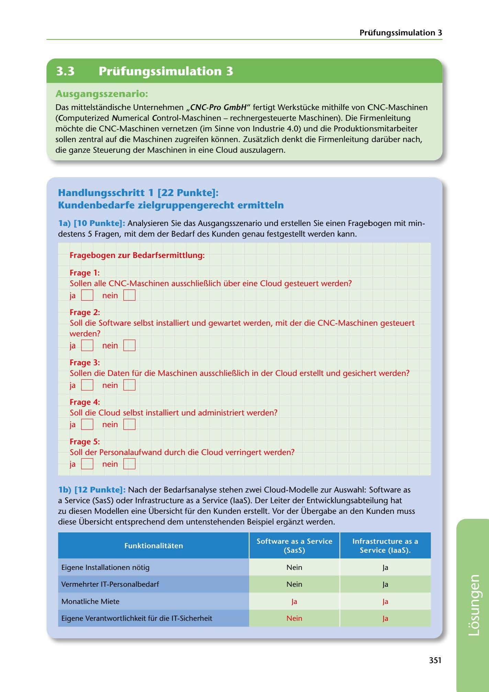

---
## Page 353
---

Prüfungssimulation 3

<!-- IMAGE: page-353-img-1.jpeg - TODO: Add description -->

### Ausgangsszenario:

Das mittelstandisclhe Unternehmen ,,CNC-Pro GmbH" fertigt Werkstücke mithilfe von CNC-Maschinen (Computerized Numerical Control-Maschinen - rechnergesteuerte Maschinen). Die Firmenleitung mochte die CNC-Maschinen vernetzen (im Sinne von Industrie 4.0) und die Produktionsmitarbeiter sollen zentral auf die Maschinen zugreifen konnen. Zusatzlich denkt die Firmenleitung darüber nach, die ganze Steuerung der Maschinen in eine Cloud auszulagern.

## Handlungsschritt 1 (22 Punkte]:

### Kundenbedarfe zielgruppengerecht ermitteln

la) (10 Punkte]: Analysieren Sie das Ausgangsszenario und erstellen Sie einen Fragebogen mit min- destens 5 Fragen, mit dem der Bedarf des Kunden genau festgestellt werden kann.

### Fragebogen zur Bedarfsermittlung:

### Frage 1:

Sollen alle CNC-Maschinen ausschliel11ich über eine Cloud gesteuert werden?

# ja D

# nein D

### Frage 2:

# ja O nein O

Soll die Software selbst installiert und gewartet werden, mit der die CNC-Maschinen gesteuert werden?

### Frage 3:

Sollen die Daten für die Maschinen ausschliel11ich in der Cloud erstellt und gesichert werden?

# ja D

# nein D

### Frage 4:

Soll die Cloud selbst installiert und administriert werden?

# ja D

# nein D

### Frage 5:

Soll der Personalaufwand durch die Cloud verringert werden?

# ja D

# nein D

lb) (12 Punkte]: Nach der Bedarfsanalyse stehen zwei Cloud-Modelle zur Auswahl: Software as a Service (SasS) oder lnfrastructure as a Service (laaS). Der Leiter der Entwicklungsabteilung hat zu diesen Modellen eine Übersicht für den Kunden erstellt. Vor der Übergabe an den Kunden muss diese Übersicht entsprechend dem untenstehenden Beispiel erganzt werden.

Funktionalitaten

### Software as a Service

### (SasS)

lnfrastructure as a Service (laaS).

Eigene lnstallationen néitig

Nein

Ja

Vermehrter IT-Personalbedarf

Nein

Ja

Monatliche Miete

Ja

Ja

Eigene Verantwortlichkeit für die IT-Sicherheit

Nein

Ja

**[VISUAL: EXAM SIMULATION 3 SCENARIO HEADER AND SAAS VS IAAS COMPARISON TABLE]**
Header image for Exam Simulation 3 featuring CNC-Pro GmbH Industry 4.0 cloud integration scenario. Includes a completed comparison table of SaaS (Software as a Service) vs IaaS (Infrastructure as a Service) functionality: installation requirements (Nein/Ja), IT personnel needs (Nein/Ja), monthly rental costs (Ja/Ja), and IT security responsibility (Nein/Ja).

351

**[VISUAL: EXAM SIMULATION 3 SCENARIO HEADER AND SAAS VS IAAS COMPARISON TABLE]**
Header image for Exam Simulation 3 featuring CNC-Pro GmbH Industry 4.0 cloud integration scenario. Includes a completed comparison table of SaaS (Software as a Service) vs IaaS (Infrastructure as a Service) functionality: installation requirements (Nein/Ja), IT personnel needs (Nein/Ja), monthly rental costs (Ja/Ja), and IT security responsibility (Nein/Ja).
