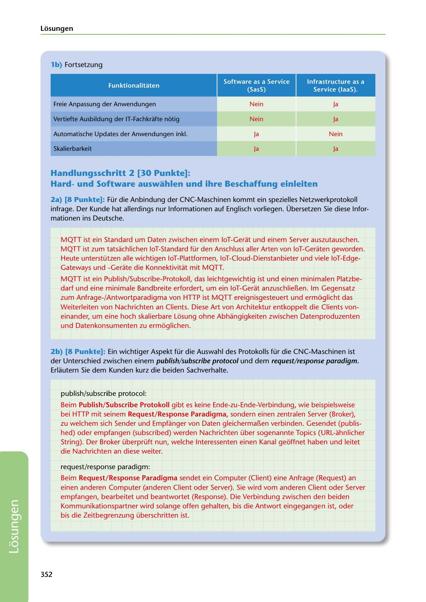

---
## Page 354
---

Losungen

### lb) Fortsetzung

Funktionalitaten

lnfrastructure as a Service (laaS).

Software as a Service (SasS)

Freie Anpassung der Anwendungen

Nein

Ja

Nein

Vertiefte Ausbildung der IT-Fachkrafte notig

Ja

Automatische Updates der Anwendungen inkl.

Nein

Ja

Skalierbarkeit

Ja

Ja

## Handlungsschritt 2 [30 Punkte]:

### Hardund Software auswahlen und ihre Beschaffung einleiten

2a) (8 Punkte]: Für die Anbindung der CNC-Maschinen kommt ein spezielles Netzwerkprotokoll infrage. Der Kunde hat allerdings nur lnformationen auf Englisch vorliegen. Übersetzen Sie diese lnfor- mationen ins Deut:sche.

MQTT ist ein Standard um Daten zwischen einem loT-Gerat und einem Server auszutauschen. MQTT ist zum tatsachlichen loT-Standard für den Anschluss aller Arten von loT-Geraten geworden. Heute unterstützen alle wichtigen loT-Plattformen, loT-Cloud-Dienstanbieter und viele loT-Edge- Gateways und -Gerate die Konnektivitat mit MQTT.

MQTT ist ein Publish/Subscribe-Protokoll, das leichtgewichtig ist und einen minimalen Platzbe- darf und eine minimale Bandbreite erfordert, um ein loT-Gerat anzuschlier..en. lm Gegensatz zum Anfrage-/Antwortparadigma von HTTP ist MQTT ereignisgesteuert und ermoglicht das Weiterleiten van Nachrichten an Clients. Diese Art van Architektur entkoppelt die Clients von- einander, um eine hoch skalierbare Losung ohne Abhangigkeiten zwischen Datenproduzenten und Datenkonsumenten zu ermoglichen.

2b) [8 Punkte]: Ein wichtiger Aspekt für die Auswahl des Protokolls für die CNC-Maschinen ist der Unterschied zwischen einem publish/subscribe protocol und dem request/response paradigm. Erlautern Sie dem Kunden kurz die beiden Sachverhalte.

publish/subscribe protocol:

Beim Publish/Subscribe Protokoll gibt es keine Ende-zu-Ende-Verbindung, wie beispielsweise bei HTTP mit seinem Request/Response Paradigma, sondern einen zentralen Server (Broker), zu welchem sich Sender und Empfanger von Daten gleichermar..en verbinden. Gesendet (publis- hed) oder empfangen (subscribed) werden Nachrichten über sogenannte Tapies (URL-ahnlicher String). Der Broker überprüft nun, welche lnteressenten einen Kanal geoffnet haben und leitet die Nachrichten an diese weiter.

request/response paradigm:

Beim Request/Response Paradigma sendet ein Computer (Client) eine Anfrage (Request) an einen anderen Computer (anderen Client oder Server). Sie wird vom anderen Client oder Server empfangen, bearbeitet und beantwortet (Response). Die Verbindung zwischen den beiden Kommunikationspartner wird solange offen gehalten, bis die Antwort eingegangen ist, oder bis die Zeitbegrenzung überschritten ist.

352

<!-- IMAGE: page-354-img-1.jpeg - TODO: Add description -->
