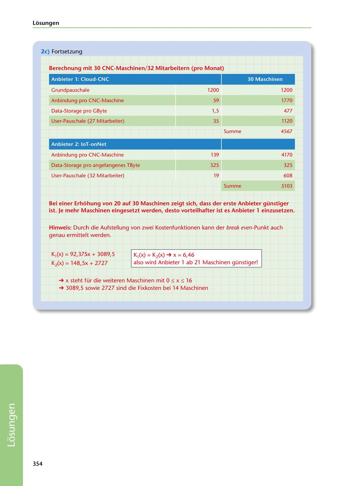

---
## Page 356
---

Losungen

### 2c) Fortsetzung

### Berechnung mit 30 CNC-Maschinen/32 Mitarbeitern (pro Monat)

### Anbieter 1: Cloud-CNC

### 30 Maschinen

Grundpauschale

1200

1200

Anbindung pro CNC-Maschine

59

1770

Data-Storage pro GByte

477

1,5

User-Pauschale (27 Mitarbeiter)

35

1120

Summe

4567

### Anbieter 2: loT-onNet

<!-- IMAGE: page-356-img-1.jpeg - TODO: Add description -->

139

Anbindung pro CNC-Maschine

4170

Data-Storage pro angefangenes TByte

325

325

User-Pauschale (32 Mitarbeiter)

19

608

Summe

5103

Bei einer Erhohung von 20 auf 30 Maschinen zeigt sich, dass der erste Anbieter günstiger ist. Je mehr Maschinen eingesetzt werden, desto vorteilhafter ist es Anbieter 1 einzusetzen.

Hinweis: Durch die Aufstellung von zwei Kostenfunktionen kann der break even-Punkt auch genau ermittelt werden.

K1(x) = 92,375x + 3089,5

K1(X) = Ki(x) ➔X= 6,46 also wird Anbieter 1 ab 21 Maschinen günstiger!

Ki(x) = 148,5x + 2727

➔ x steht für die weiteren Maschinen mit O:,; x :,; 16

➔ 3089,5 sowie 2727 sind die Fixkosten bei 14 Maschinen

354

**[VISUAL: CLOUD PROVIDER COST COMPARISON TABLES - EXAM SIMULATION 3]**
Detailed cost calculation tables comparing two cloud providers for 30 CNC machines/32 users: Cloud-CNC (Anbieter 1) showing €4,567/month total with itemized costs for Grundpauschale, machine connections, data storage, and user licenses. IoT-onNet (Anbieter 2) showing €5,103/month total. Includes break-even analysis formulas showing Provider 1 becomes cheaper at 21+ machines.
