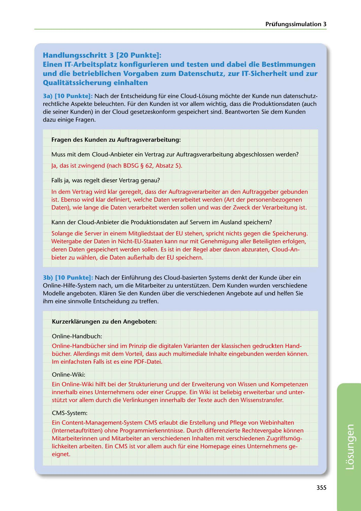

---
## Page 357
---

Prüfungssimulation 3

## Handlungsschritt 3 [20 Punkte]:

### Qualitatssicherung einhalten

Einen IT-Arbeitsplatz konflgurieren und testen und dabei die Bestimmungen und die betrieblichen Vorgaben zum Datenschutz, zur IT-Sicherheit und zur

3a) (10 Punkte]: Nach der Entscheidung für eine Cloud-Losung mochte der Kunde nun datenschutz- rechtliche Aspekte beleuchten. Für den Kunden ist vor allem wichtig, dass die Produktiansdaten (auch die seiner Kunden) in der Claud gesetzeskanform gespeichert sind. Beantwarten Sie dem Kunden dazu einige Fragen.

### Fragen des Kunden zu Auftragsverarbeitung:

Muss mit dem Claud-Anbieter ein Vertrag zur Auftragsverarbeitung abgeschlassen werden?

Ja, das ist zwingend (nach BDSG § 62, Absatz 5).

Falls ja, was regelt dieser Vertrag genau?

In dem Vertrag wird klar geregelt, dass der Auftragsverarbeiter an den Auftraggeber gebunden ist. Ebensa wird klar definiert, welche Daten verarbeitet werden (Art der persanenbezagenen Daten), wie lange die Daten verarbeitet werden sallen und was der Zweck der Verarbeitung ist.

Kann der Claud-Anbieter die Produktiansdaten auf Servern im Ausland speichern?

Salange die Server in einem Mitgliedstaat der EU stehen, spricht nichts gegen die Speicherung. Weitergabe der Daten in Nicht-EU-Staaten kann nur mit Genehmigung aller Beteiligten erfolgen, deren Daten gespeichert werden sallen. Es ist in der Regel aber davan abzuraten, Claud-An- bieter zu wahlen, die Daten aul1erhalb der EU speichern.

3b) [10 Punkte]: Nach der Einführung des Claud-basierten Systems denkt der Kunde über ein Online-Hilfe-System nach, um die Mitarbeiter zu unterstützen. Dem Kunden wurden verschiedene Madelle angebaten. Klaren Sie den Kunden über die verschiedenen Angebate auf und helfen Sie ihm eine sinnvalle Entscheidung zu treffen.

### Kurzerklarungen zu den Angeboten:

Online-Handbuch:

Online-Handbücher sind im Prinzip die digitalen Varianten der klassischen gedruckten Hand- bücher. Allerdings mit dem Varteil, dass auch multimediale lnhalte eingebunden werden konnen. lm einfachsten Falls ist es eine PDF-Datei.

Online-Wiki:

Ein Online-Wiki hilft bei der Strukturierung und der Erweiterung van Wissen und Kampetenzen innerhalb eines Unternehmens ader einer Gruppe. Ein Wiki ist beliebig erweiterbar und unter- stützt var allem durch die Verlinkungen innerhalb der Texte auch den Wissenstransfer.

CMS-System:

Ein Cantent-Management-System CMS erlaubt die Erstellung und Pflege van Webinhalten (lnternetauftritten) ahne Pragrammierkenntnisse. Durch differenzierte Rechtevergabe konnen Mitarbeiterinnen und Mitarbeiter an verschiedenen lnhalten mit verschiedenen Zugriffsmog- lichkeiten arbeiten. Ein CMS ist var allem auch für eine Hamepage eines Unternehmens ge- eignet.

### 355

<!-- IMAGE: page-357-img-1.jpeg - TODO: Add description -->
