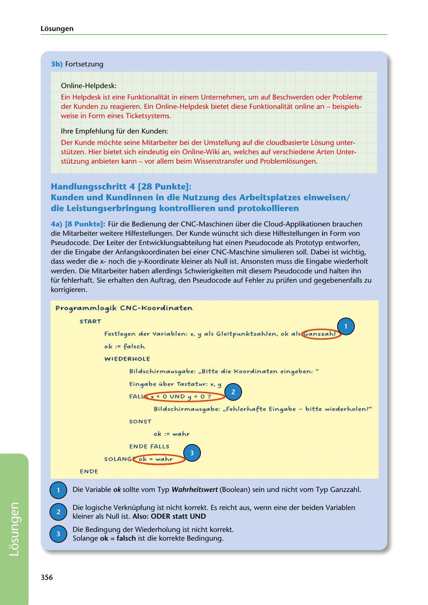

---
## Page 358
---

Losungen

### 3b) Fortsetzung

Online-Helpdesk:

Ein Helpdesk ist eine Funktionalitat in einem Unternehmen, um auf Beschwerden oder Probleme der Kunden zu reagieren. Ein Online-Helpdesk bietet diese Funktionalitat online an - beispiels- weise in Form eines Ticketsystems.

lhre Empfehlung für den Kunden:

Der Kunde mochte seine Mitarbeiter bei der Umstellung auf die cloudbasierte Losung unter- stützen. Hier bietet sich eindeutig ein Online-Wiki an, welches auf verschiedene Arten Unter- stützung anbieten kann - vor allem beim Wissenstransfer und Problemlosungen.

## Handlungsschritt 4 [28 Punkte]:

### die Leistungserbringung kontrollieren und protokollieren

Kunden und Kundinnen in die Nutzung des Arbeitsplatzes einweisen/

4a) [8 Punkte]: Für die Bedienung der CNC-Maschinen über die Cloud-Applikationen brauchen die Mitarbeiter weitere Hilfestellungen. Der Kunde wünscht sich diese Hilfestellungen in Form von Pseudocode. Der Leiter der Entwicklungsabteilung hat einen Pseudocode als Prototyp entworfen, der die Eingabe der Anfangskoordinaten bei einer CNC-Maschine simulieren soll. Dabei ist wichtig, dass weder die xnoch die y-Koordinate kleiner als Null ist. Ansonsten muss die Eingabe wiederholt werden. Die Mitairbeiter haben allerdings Schwierigkeiten mit diesem Pseudocode und halten ihn für fehlerhaft. Sie erhalten den Auftrag, den Pseudocode auf Fehler zu prüfen und gegebenenfalls zu korrigieren.

### Pro~rotrnrnlosik C NCk ooroli notten

### START

•

### n2.2.ci16!)

Festle,en oler Vco·ici1blen: x, ::, ci1ls Gleitp .... nkt2.ci1h.len, ok ci1ls€

### ok := fci1lsch.

### WI EDERH OLE

Bilolsch.irrnci1 .... s,ci1be: .. Bitte olie Koorolinci1ten ein,eben: "

Ein,ci1be i4be.- Tci1stci1t .... .-: x, ::,

FAL .X< o UNO

<!-- IMAGE: page-358-img-1.jpeg - TODO: Add description -->

Bilolsch.irrnC111As9ci1be: .. Feh.lerh.ci1~e Ein9ci1be - bitte wieolerh.olen!"

SONST

ok := wci1h.r-

# ENDE ~S ..

SOLANG~

ENDE

Die Variable ok sollte vom Typ Wahrheitswert (Boolean) sein und nicht vom Typ Ganzzahl.

### kleiner als Null ist. Also: ODER statt UND

Die logische Verknüpfung ist nicht korrekt. Es reicht aus, wenn eine der beiden Variablen

### Solange ok = falsch ist die korrekte Bedingung.

Die Bedingung der Wiederholung ist nicht korrekt.

# • • •

356

**[VISUAL: PSEUDO-CODE DEBUGGING EXERCISE - EXAM SIMULATION 3 SOLUTION]**
A pseudo-code example for CNC coordinate input validation with annotated error corrections. Shows: variable declarations (x, y as floating point, ok as Boolean), WIEDERHOLE loop structure, input prompts, conditional logic checking coordinates ≥ 0. Error annotations point out: incorrect Boolean type declaration, wrong logical operator (should be ODER not UND), and incorrect loop condition (should be "ok = falsch").
